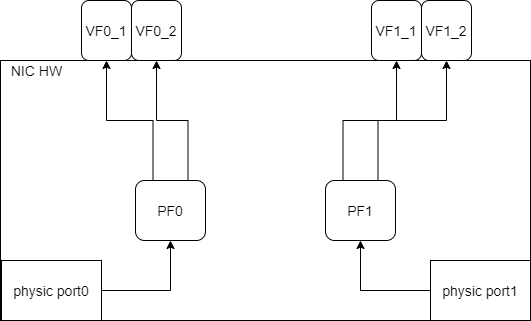
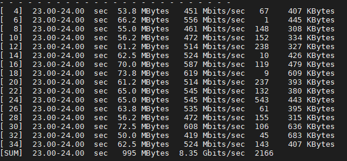
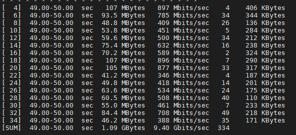

ovs VF LAG 允许将网卡的两个 PF bond 到一起，并且 ovs 会将它们 offload 到硬件 e-switch 上。目前支持的模式包括：

- Active-Backup
- XOR
- LACP

VF LAG 可以完全 offload 到硬件上。bonding 会创建出一个 PF 端口，上游的包可以是从任意一个物理端口中传来的，并且被转发到这个 bond 设备上。

开启硬件 offload 之后，任意端口过来的包都可以被转发到任意 vf 上（无论是 PF0 还是 PF1 上分出来的 vf）。同样，来自 VF 的流量也可以被转发到任意物理端口（由具体的 bond 模式决定）。在 AB 模式下，只有一个 PF 会 up 起来，所有 vf 的流量都走这个 PF。XOR 或者 LACP 模式下，如果两个 PF 都 up 起来，VF 流量会分配到两个不同的 PF 上。

bond 前后结构可理解为如下图：




# VF LAG 配置

> 注意该配置走的是内核协议栈。

为了开启 VF LAG，首先需要为 PF 开启 SwitchDev 模式，之后再将 representors 和 bond 添加到同一个 bridge 上。

1. 添加 bond 设备，并将 PF 添加为 slave。

   ```bash
   $ modprobe bonding mode=802.3ad
   # 注意这里miimon一定要配置否则bond不会正常启用
   $ iP link add enp24bond type bond mode active-backup miimon 100
   $ ip link set enp24s0f0 master bond0
   $ ip link set enp24s0f1 master bond0
   ```

2. 将 vf representor 和 bond 添加到 bridge 上。

   ```bash
   $ ovs-vsctl add-port ovs-sriov bond0
   $ ovs-vsctl add-port ovs-sriov enp24s0f0_0
   $ ovs-vsctl add-port ovs-sriov enp24s0f1_0
   ```

3. 将 PF 和 representor 设备 up 起来。

   ```bash
   $ ip link set dev bond0 up
   $ ip link set dev enp4s0f0_0 up
   $ ip link set dev enp4s0f1_0 up
   ```

# 限制

- In VF LAG mode, outgoing traffic in load balanced mode is according to the origin ring, thus, half
  of the rings will be coupled with port 1 and half with port 2. All the traffic on the same ring will
  be sent from the same port.  
- 当 mlxconfig 中配置的 NUM_OF_VFS 大于 64 的时候，无法配置 VF LAG

# ovs-dpdk vf lag

> 注意该配置使用的是 ovs-dpdk，必须严格按照顺序配置，否则会出错。前几步的配置与 ovs-dpdk-vdpa 的配置相同，但是**注意重点在于不要随意使用 ip 命令操作 pf，否则在配置 port 的时候，ovs 会认为该设备正在被 kernel 内核占用**。

1. 切割网卡

   ```bash
   # 删除旧配置
   $ ovs-vsctl del-br br-bond
   $ /usr/share/openvswitch/scripts/ovs-ctl stop
   $ ip link del enp24bond
   # 重置网卡
   $ echo 0 >  /sys/class/net/enp24s0f0/device/sriov_numvfs
   $ echo 0 >  /sys/class/net/enp24s0f1/device/sriov_numvfs
   $ systemctl restart openibd.service
   $ echo 2 > /sys/class/net/enp24s0f0/device/sriov_numvfs
   $ echo 2 > /sys/class/net/enp24s0f1/device/sriov_numvfs
   ```

2. unbind vfs

   ```bash
   $ echo 0000:18:00.2 > /sys/bus/pci/drivers/mlx5_core/unbind
   $ echo 0000:18:00.3 > /sys/bus/pci/drivers/mlx5_core/unbind
   $ echo 0000:18:01.2 > /sys/bus/pci/drivers/mlx5_core/unbind
   $ echo 0000:18:01.3 > /sys/bus/pci/drivers/mlx5_core/unbind
   ```

3. 将 e-switch 的模式切换为`switchdev`，此时会出现 vf representor

   ```bash
   $ echo switchdev > /sys/class/net/enp24s0f0/compat/devlink/mode
   $ echo switchdev > /sys/class/net/enp24s0f0/compat/devlink/mode
   ```

4. 启动 Open vSwitch 服务

   ```bash
   $ systemctl restart openvswitch
   ```

5. 设置数据库和 DPDK 白名单，开启 hardware offload

   ```bash
   $ ovs-vsctl --no-wait set Open_vSwitch . other_config:dpdk-init=true
   $ ovs-vsctl set Open_vSwitch . other_config:hw-offload=true
   $ ovs-vsctl --no-wait set Open_vSwitch . other_config:dpdk-extra="-w 0000:18:00.0,representor=[0,1],dv_flow_en=1,dv_esw_en=1,dv_xmeta_en=1 -w 0000:18:00.1,representor=[0,1],dv_flow_en=1,dv_esw_en=1,dv_xmeta_en=1"
   ```

   **注意：**representor中填写对应的编号，填写[0,N]，代表将从 0 到 N 的 representor 都加入白名单。

6. 重启 Open vSwitch 服务，需要重启才能够使 HW offload 修改生效

   ```bash
   $ systemctl restart openvswitch
   ```

7. 配置 bond

   ```bash
   $ ip link set enp24s0f0 down
   $ ip link set enp24s0f1 down
   
   #  active-backup|balance-xor|lacp
   # ip link add enp24bond type bond mode active-backup miimon 100
   # ip link add enp24bond type bond mode balance-xor miimon 100
   $ ip link add enp24bond type bond mode 802.3ad miimon 100 lacp_rate fast xmit_hash_policy layer3+4
   $ ip link set enp24s0f0 master enp24bond
   $ ip link set enp24s0f1 master enp24bond
   ```

8. 添加 bond 中的第一个 pf 到 bridge

   ```bash
   $ ovs-vsctl add-br br-bond -- set Bridge br-bond datapath_type=netdev
   $ ovs-vsctl add-port br-bond p0 -- set Interface p0 type=dpdk options:dpdk-devargs=0000:18:00.0 options:dpdklsc-interrupt=true
   ```
   
> To work with VF-LAG with OVS-DPDK, add the bond master (PF) to the bridge. Note that the first
   > PF on which you run "ip link set <PF> master bond0" becomes the bond master.  

9. 将 vf 绑定回去(*注意：这一步一定要在添加完 pf 之后*)

   ```bash
   $ echo 0000:18:00.2 > /sys/bus/pci/drivers/mlx5_core/bind
   $ echo 0000:18:01.2 > /sys/bus/pci/drivers/mlx5_core/bind
   $ echo 0000:18:00.3 > /sys/bus/pci/drivers/mlx5_core/bind
   $ echo 0000:18:01.3 > /sys/bus/pci/drivers/mlx5_core/bind
   ```

10. 添加 port

    ```bash
    $ ovs-vsctl add-port br-bond vdpa0 -- set Interface vdpa0 type=dpdkvdpa options:vdpa-socket-path=/var/run/virtio-forwarder/sock0 options:vdpa-accelerator-devargs=0000:18:00.2 options:dpdk-devargs=0000:18:00.0,representor=[0] options:vdpa-max-queues=8
    
    $ ovs-vsctl add-port br-bond vdpa1 -- set Interface vdpa1 type=dpdkvdpa options:vdpa-socket-path=/var/run/virtio-forwarder/sock1 options:vdpa-accelerator-devargs=0000:18:00.3 options:dpdk-devargs=0000:18:00.0,representor=[1] options:vdpa-max-queues=8
    
    $ ovs-vsctl add-port br-bond vdpa2 -- set Interface vdpa2 type=dpdkvdpa options:vdpa-socket-path=/var/run/virtio-forwarder/sock2 options:vdpa-accelerator-devargs=0000:18:01.2 options:dpdk-devargs=0000:18:00.1,representor=[0] options:vdpa-max-queues=8
    
    $ ovs-vsctl add-port br-bond vdpa3 -- set Interface vdpa3 type=dpdkvdpa options:vdpa-socket-path=/var/run/virtio-forwarder/sock3 options:vdpa-accelerator-devargs=0000:18:01.3 options:dpdk-devargs=0000:18:00.1,representor=[1] options:vdpa-max-queues=8
    ```
    
11. 重启 openvswitch

    ```bash
    $ systemctl restart openvswitch
    ```

## 测试

### active-backup

完成配置之后，从虚拟机 vm1 ping 虚拟机 vm2，使用 ovs 命令查看 flow 是否 offload 下去了：

```bash
$ ovs-appctl dpctl/dump-flows -m
flow-dump from pmd on cpu core: 11
ufid:888825cd-9f23-4d72-8ee4-a4b5b1e32ec2, skb_priority(0/0),skb_mark(0/0),ct_state(0/0),ct_zone(0/0),ct_mark(0/0),ct_label(0/0),recirc_id(0),dp_hash(0/0),in_port(vdpa1),packet_type(ns=0,id=0),eth(src=de:75:cc:e1:c6:86,dst=de:75:cc:e1:c6:85),eth_type(0x0800),ipv4(src=192.168.100.12/0.0.0.0,dst=192.168.100.11/0.0.0.0,proto=1/0,tos=0/0,ttl=64/0,frag=no),icmp(type=8/0,code=0/0), packets:60, bytes:5880, used:0.023s, offloaded:yes, dp:dpdk, actions:p0, dp-extra-info:miniflow_bits(5,1)
ufid:f6992c32-c728-4640-9b45-c7dcee287f26, skb_priority(0/0),skb_mark(0/0),ct_state(0/0),ct_zone(0/0),ct_mark(0/0),ct_label(0/0),recirc_id(0),dp_hash(0/0),in_port(p0),packet_type(ns=0,id=0),eth(src=de:75:cc:e1:c6:85,dst=de:75:cc:e1:c6:86),eth_type(0x0806),arp(sip=192.168.100.11/0.0.0.0,tip=192.168.100.12/0.0.0.0,op=2/0,sha=de:75:cc:e1:c6:85/00:00:00:00:00:00,tha=de:75:cc:e1:c6:86/00:00:00:00:00:00), packets:1, bytes:60, used:3.027s, offloaded:yes, dp:dpdk, actions:vdpa1, dp-extra-info:miniflow_bits(5,0)
ufid:26f85613-edd7-44ea-aff8-2a1b013bef55, skb_priority(0/0),skb_mark(0/0),ct_state(0/0),ct_zone(0/0),ct_mark(0/0),ct_label(0/0),recirc_id(0),dp_hash(0/0),in_port(p0),packet_type(ns=0,id=0),eth(src=de:75:cc:e1:c6:85,dst=de:75:cc:e1:c6:86),eth_type(0x0800),ipv4(src=192.168.100.11/0.0.0.0,dst=192.168.100.12/0.0.0.0,proto=1/0,tos=0/0,ttl=64/0,frag=no),icmp(type=0/0,code=0/0), packets:60, bytes:5880, used:0.023s, offloaded:yes, dp:dpdk, actions:vdpa1, dp-extra-info:miniflow_bits(5,1)
ufid:64774037-ac1b-48a4-8eb7-5231a4f60732, skb_priority(0/0),skb_mark(0/0),ct_state(0/0),ct_zone(0/0),ct_mark(0/0),ct_label(0/0),recirc_id(0),dp_hash(0/0),in_port(vdpa1),packet_type(ns=0,id=0),eth(src=de:75:cc:e1:c6:86,dst=de:75:cc:e1:c6:85),eth_type(0x0806),arp(sip=192.168.100.12/0.0.0.0,tip=192.168.100.11/0.0.0.0,op=1/0,sha=de:75:cc:e1:c6:86/00:00:00:00:00:00,tha=00:00:00:00:00:00/00:00:00:00:00:00), packets:1, bytes:60, used:3.027s, offloaded:yes, dp:dpdk, actions:p0, dp-extra-info:miniflow_bits(5,0)
```

所有 flow 的`offloaded:yes`，卸载成功，iperf3 测试正常。

1. 拔掉其中一根网线，依旧能够 ping 通，
2. 拔掉两根网线，无法 ping 通；
3. 插回任意一根网线，可以 ping 通

>如果出现网线已连接并且配置成功，但是无法 ping 通的情况，可以先用 ip 命令把两个 pf 和 bond 都 down 掉。

### XOR

依旧出现偶尔无法 ping 通的情况，若在可 ping 通时，使用 iperf3 测试带宽，则网络会立马断开，之后无法再 ping 通。

两虚拟机不通时，dumpflow 会显示有一条路径无法 offload，若能通则所有路径都可以 offload。



> 在使用非 ovs-dpdk 的方式跑了 xor 测试，同样带宽没有上来，但是带宽跳动比较大。
>
> 

### LACP

通过 lacp 方式，可以 ping 通，但是 iperf3 测试带宽未加倍，flow offload 成功，shutdown 一个端口，bond 工作正常


询问翀哥，似乎是因为盛科的交换机有问题，思科的测试能够跑出 double 带宽，h3c 和华为只有当进程不同时才能够跑满带宽。

> 在使用非 ovs-dpdk 的方式跑了 lacp 测试，同样带宽没有上来

# shell script

```bash
#!/bin/bash
# DO NOT EDIT THIS FILE AND NEVERY CHANGE THE ORDER OF THIS COMMAND 

#systemctl start openvswitch.service
#ovs-vsctl --no-wait set Open_vSwitch . other_config:dpdk-init=true
#ovs-vsctl set Open_vSwitch . other_config:hw-offload=true
#ovs-vsctl --no-wait set Open_vSwitch . other_config:dpdk-extra="-w 0000:18:00.0,representor=[0,1],dv_flow_en=1,dv_esw_en=1,dv_xmeta_en=1 -w 0000:18:00.1,representor=[0,1],dv_flow_en=1,dv_esw_en=1,dv_xmeta_en=1"
#systemctl start openvswitch.service

ovs-vsctl del-br br-bond
/usr/share/openvswitch/scripts/ovs-ctl stop
ip link del enp24bond

echo 0 >  /sys/class/net/enp24s0f0/device/sriov_numvfs
echo 0 >  /sys/class/net/enp24s0f1/device/sriov_numvfs
systemctl restart openibd.service
echo 2 >  /sys/class/net/enp24s0f0/device/sriov_numvfs
echo 2 >  /sys/class/net/enp24s0f1/device/sriov_numvfs
echo 0000:18:00.2 > /sys/bus/pci/drivers/mlx5_core/unbind
echo 0000:18:01.2 > /sys/bus/pci/drivers/mlx5_core/unbind
echo 0000:18:00.3 > /sys/bus/pci/drivers/mlx5_core/unbind
echo 0000:18:01.3 > /sys/bus/pci/drivers/mlx5_core/unbind

echo switchdev > /sys/class/net/enp24s0f0/compat/devlink/mode
echo switchdev > /sys/class/net/enp24s0f1/compat/devlink/mode

ip link set enp24s0f0 down
ip link set enp24s0f1 down
#  active-backup|balance-xor|lacp
#ip link add enp24bond type bond mode active-backup miimon 100
#ip link add enp24bond type bond mode balance-xor miimon 100 xmit_hash_policy layer3+4
ip link add enp24bond type bond mode 802.3ad miimon 100 lacp_rate fast xmit_hash_policy layer3+4
ip link set enp24s0f0 master enp24bond
ip link set enp24s0f1 master enp24bond

systemctl restart openvswitch.service

ovs-vsctl add-br br-bond -- set Bridge br-bond datapath_type=netdev
ovs-vsctl add-port br-bond p0 -- set Interface p0 type=dpdk options:dpdk-devargs=0000:18:00.0 options:dpdklsc-interrupt=true

echo 0000:18:00.2 > /sys/bus/pci/drivers/mlx5_core/bind
echo 0000:18:01.2 > /sys/bus/pci/drivers/mlx5_core/bind
echo 0000:18:00.3 > /sys/bus/pci/drivers/mlx5_core/bind
echo 0000:18:01.3 > /sys/bus/pci/drivers/mlx5_core/bind

ovs-vsctl add-port br-bond vdpa0 -- set Interface vdpa0 type=dpdkvdpa options:vdpa-socket-path=/var/run/virtio-forwarder/sock0 options:vdpa-accelerator-devargs=0000:18:00.2 options:dpdk-devargs=0000:18:00.0,representor=[0] options:vdpa-max-queues=8

ovs-vsctl add-port br-bond vdpa1 -- set Interface vdpa1 type=dpdkvdpa options:vdpa-socket-path=/var/run/virtio-forwarder/sock1 options:vdpa-accelerator-devargs=0000:18:00.3 options:dpdk-devargs=0000:18:00.0,representor=[1] options:vdpa-max-queues=8


ovs-vsctl add-port br-bond vdpa2 -- set Interface vdpa2 type=dpdkvdpa options:vdpa-socket-path=/var/run/virtio-forwarder/sock2 options:vdpa-accelerator-devargs=0000:18:01.2 options:dpdk-devargs=0000:18:00.1,representor=[0] options:vdpa-max-queues=8

ovs-vsctl add-port br-bond vdpa3 -- set Interface vdpa3 type=dpdkvdpa options:vdpa-socket-path=/var/run/virtio-forwarder/sock3 options:vdpa-accelerator-devargs=0000:18:01.3 options:dpdk-devargs=0000:18:00.1,representor=[1] options:vdpa-max-queues=8

/usr/share/openvswitch/scripts/ovs-ctl restart

```


