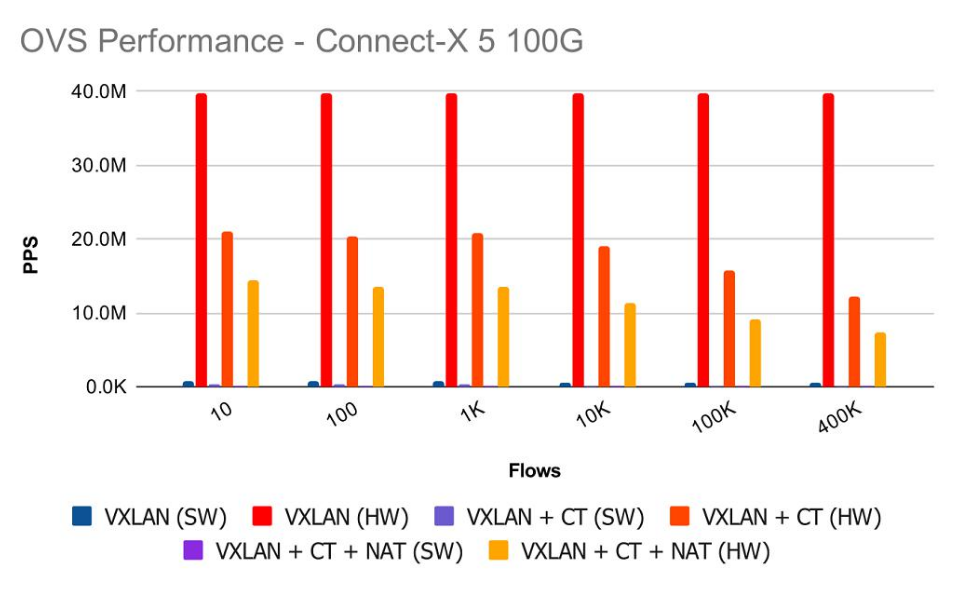
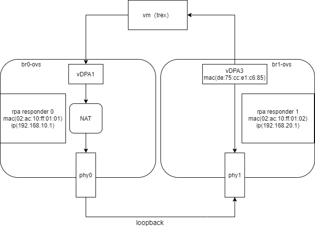
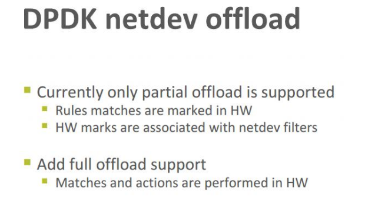

先看一张 mellanox 官方对 Hardware offloads 在 flow 数量影响下的网络性能图。



# 网络拓扑配置

## 拓扑结构

测试服务器上网络设置如下：

```bash
$  ovs-vsctl show
4a2a6ed5-c59f-4e8a-b922-f54d07efc5ba
    Bridge br0-ovs
        datapath_type: netdev
        Port pf0
            Interface pf0
                type: dpdk
                options: {dpdk-devargs="0000:65:00.0"}
        ...
        Port br0-ovs
            Interface br0-ovs
                type: internal
        Port vdpa1
            Interface vdpa1
                type: dpdkvdpa
                options: {dpdk-devargs="0000:65:00.0,representor=[1]", vdpa-accelerator-devargs="0000:65:00.3", vdpa-max-queues="8", vdpa-socket-path="/var/run/virtio-forwarder/sock1"}
    Bridge br1-ovs
        datapath_type: netdev
        Port pf1
            Interface pf1
                type: dpdk
                options: {dpdk-devargs="0000:65:00.1"}
        Port vdpa3
            Interface vdpa3
                type: dpdkvdpa
                options: {dpdk-devargs="0000:65:00.1,representor=[1]", vdpa-accelerator-devargs="0000:65:01.3", vdpa-max-queues="8", vdpa-socket-path="/var/run/virtio-forwarder/sock3"}
        Port br1-ovs
            Interface br1-ovs
                type: internal
        ...
    ovs_version: "2.13.1"

```

connect-x5 的两个 pf 分别在两个网桥上，网桥上分别挂了 vdpa1 和 vdpa3，这是后面测试机要使用的。

测试环境的网络拓扑图如图：




我们使用一台 VM 虚拟机作为测试仪，安装好 trex。虚拟机通过 vhost-usr 的方式分别连接到 vDPA1 和 vDPA3。两个物理端口（phy0 和 phy1）互联，形成回环。

虚拟机配置为：8C8G

## 流表配置

1. 为了使 trex 能够正常工作，我们需要分别为 vDPA1 和 vDPA3 构建一个 rpa responder，用于虚拟出一个网关，rpa responder 会在 vm 向网关发出 arp 请求的时候，返回一个虚拟的 mac 地址，这个 mac 地址就是网关的地址；
2. 为了测试 NAT 规则数对 connect-x5 性能的影响，我们需要使用 ct 和 nat 构建一个虚拟的 NAT。

基本配置如下：

```bash
#0 arp responder for ip:192.168.20.1 mac:02:ac:10:ff:01:02, corresponding to vDPA3
$ ovs-ofctl mod-flows br1-ovs "table=0,arp,in_port=vdpa3,arp_op=1,arp_tpa=192.168.20.1 actions=move:NXM_OF_ETH_SRC[]->NXM_OF_ETH_DST[],mod_dl_src:02:ac:10:ff:01:02,load:0x2->NXM_OF_ARP_OP[],move:NXM_NX_ARP_SHA[]->NXM_NX_ARP_THA[],load:0x02ac10ff0102->NXM_NX_ARP_SHA[],move:NXM_OF_ARP_SPA[]->NXM_OF_ARP_TPA[],load:0xc0a81401->NXM_OF_ARP_SPA[],IN_PORT"

#1 arp responder for ip:192.168.10.1 mac:02:ac:10:ff:01:01, corresponding to vDPA1
$ ovs-ofctl mod-flows br0-ovs "table=0,arp,in_port=vdpa1,arp_op=1,arp_tpa=192.168.10.1 actions=move:NXM_OF_ETH_SRC[]->NXM_OF_ETH_DST[],mod_dl_src:02:ac:10:ff:01:01,load:0x2->NXM_OF_ARP_OP[],move:NXM_NX_ARP_SHA[]->NXM_NX_ARP_THA[],load:0x02ac10ff0101->NXM_NX_ARP_SHA[],move:NXM_OF_ARP_SPA[]->NXM_OF_ARP_TPA[],load:0xc0a80a01->NXM_OF_ARP_SPA[],IN_PORT"

#2 将所有来自vdpa1并且目标地址是48.0.0.0/8的流量，做SNAT，将src统一改为 48.128.0.10
$ ovs-ofctl add-flow br0-ovs "table=0,ip,priority=10,in_port=vdpa1,nw_dst=48.0.0.0/8  actions=ct(commit,table=1,nat(src=48.128.0.10))"

#3 所有来自48.128.0.10并且目标地址是48.0.0.0/8的流量修改目标mac地址为虚拟机另一端口地址，直接发送
$ ovs-ofctl add-flow br0-ovs "table=1,ip,nw_src=48.128.0.10,nw_dst=48.0.0.0/8 actions=mod_dl_src:02:ac:10:ff:01:01,mod_dl_dst:de:75:cc:e1:c6:85,output:pf0"
```

## caps 配置 limit 标志

基础配置如下：

```yaml
#
# Simple IMIX test 64B
#
- duration : 1
  generator :
          distribution : "seq"
          clients_start : "16.0.0.1"
          clients_end   : "16.0.0.255"
          servers_start : "48.0.0.1"
          servers_end   : "48.0.255.255"
          clients_per_gb : 201
          min_clients    : 101
          dual_port_mask : "1.0.0.0"
          tcp_aging      : 0
          udp_aging      : 0
  cap_info :
     - name: cap2/udp_64B.pcap
       cps   : 10000.0
       ipg   : 10000
       rtt   : 10000
       w     : 1
       limit : 255
```

参考 caps 文件基本配置，`clients_start` - `client_end`代表发送端可使用的 IP，server 端同理。那么在该配置下，可能出现的 src_ip 和 dest_ip 组合为
$$
(256-1) * (256*256-1)
$$
如果设置 limit 为 256，那么这个组合会被限制在 255 个，实际的 flow 是:

````plain
src_ip = 16.0.0.1 
dest_ip = 48.0.0.1 ~ 48.0.0.255
````

如果 limit 设置为 65535，那么：

```plain
src_ip = 16.0.0.1 
dest_ip = 48.0.0.1 ~ 48.0.255.255
```

若 limit 设置为 65535 * 2，那么

```plain
src_ip = 16.0.0.1 ~ 16.0.0.2 
dest_ip = 48.0.0.1 ~ 48.0.255.255
```

trex 并不是在`(256-1) * (256*256-1)`范围内随机抽取，它总是取前面的，正如[官方文档](https://trex-tgn.cisco.com/trex/doc/trex_manual.html)中的解释：

> - Repeats the flows in a loop, generating 1000 flows from this type. In this example, udp_64B includes only one packet.
>
> The cap file "cap2/udp_64B.pcap" includes only one packet of 64B. This configuration file creates 1000 flows that will be repeated as follows: f1 , f2 , f3 ……. f1000 , f1 , f2 … where the PPS == CPS for -m=1. In this case it will have PPS=1000 in sec for -m==1. It is possible to mix stateless templates and stateful templates.

# 基础测试

在基本测试情况下，通过修改 trex 的 caps 配置文件中 limit 参数，可影响生成的五元组丰富程度。

使用基本流表配置测试：

| 规则数（除基础条数） | 预设 pps | 预设测试时间 | 完成测试实际时间 | pps  |
| -------------------- | ------- | ------------ | ---------------- | ---- |
| 1                    | 120w    | 60s          |                  |      |
|                      | 130w    |              |                  |      |
|                      | 150w    |              |                  |      |
| 512                  | 100w    | 60s          | 1m4.560s         | 110w |
|                      | 110w    |              | 1m4.593s         |      |
|                      | 120w    |              | 1m5.308s         |      |
|                      | 130w    |              | 1m8.804s         |      |
| 1024                 | 90w     | 60s          | 1m4.534s         | 100w |
|                      | 100w    |              | 1m4.544s         |      |
|                      | 110w    |              | 1m4.790s         |      |
|                      | 120w    |              | 1m7.317s         |      |
| 5120                 | 80w     | 60s          | 1m4.518s         | 90w  |
|                      | 90w     |              | 1m4.546s         |      |
|                      | 100w    |              | 1m4.797s         |      |
|                      | 110w    |              | 1m6.794s         |      |
| 32768                | 80w     | 60s          | 1m4.566s         | 80w  |
|                      | 90w     |              | 1m4.798s         |      |
|                      | 100w    |              | 1m9.044s         |      |
| 65536                | 80w     | 60s          | 1m4.539s         | 80w  |
|                      | 90w     |              | 1m5.297s         |      |
|                      | 100w    |              | 1m9.806s         |      |
| 262144               | 60w     | 60s          | 1m5.055s         | 60w  |
|                      | 70w     |              | 1m5.053s         |      |
|                      | 80w     |              | 1m5.344s         |      |

## 增加pmd测试

使用如下命令添加 pmd，并将 vDPA 分别绑定到不同的 pmd 上：

```bash
# pmd-cpu-mask，使用掩码，6 = 0b0110，使用cpu1和cpu2
$ ovs-vsctl set Open_vSwitch . other_config:pmd-cpu-mask=6

# 查看绑定情况
$ ovs-appctl dpif-netdev/pmd-rxq-show 
# 将Rx队列绑定到对应dpmd上
$ ovs-vsctl set Interface <iface> \
    other_config:pmd-rxq-affinity=<rxq-affinity-list>
```

查看 pmd 使用情况：

```bash
$ ovs-appctl dpif-netdev/pmd-rxq-show
pmd thread numa_id 0 core_id 1:
  isolated : false
  port: pf0               queue-id:  0 (enabled)   pmd usage:  0 %
  port: pf1               queue-id:  0 (enabled)   pmd usage:  0 %
  port: vdpa1             queue-id:  0 (enabled)   pmd usage: 98 %
pmd thread numa_id 0 core_id 2:
  isolated : false
  port: vdpa0             queue-id:  0 (enabled)   pmd usage:  0 %
  port: vdpa2             queue-id:  0 (enabled)   pmd usage:  0 %
  port: vdpa3             queue-id:  0 (enabled)   pmd usage: 10 %
```

可以看到主要得压力集中在 vdpa1，也就是发送端，vdpa3 压力较小。

查看 flow 情况：

```bash
$  ovs-appctl dpctl/dump-flows
flow-dump from pmd on cpu core: 1
recirc_id(0x6),in_port(3),packet_type(ns=0,id=0),eth(src=de:75:cc:30:86:84,dst=02:ac:10:ff:01:01),eth_type(0x0800),ipv4(src=48.128.0.10,dst=48.0.0.3/255.0.0.0,frag=no), packets:50694434, bytes:3041666040, used:0.000s, actions:set(eth(src=02:ac:10:ff:01:01,dst=de:75:cc:e1:c6:85)),4
recirc_id(0),in_port(7),packet_type(ns=0,id=0),eth(src=02:ac:10:ff:01:01,dst=de:75:cc:e1:c6:85),eth_type(0x0800),ipv4(frag=no), packets:50445698, bytes:3026741880, used:0.061s, actions:5
recirc_id(0),in_port(3),packet_type(ns=0,id=0),eth_type(0x0800),ipv4(dst=48.0.0.3/255.0.0.0,frag=no), packets:50694498, bytes:3041669880, used:0.000s, actions:ct(commit,nat(src=48.128.0.10)),recirc(0x6)
```

可以看到大多数规则在 core1 上，因此 pmd0 上 cpu 压力较大。

> 疑点：flow 规则分明 offload 成功了，为何 pmd 压力会如此之大。在无 NAT 的测试（去规则测试）中，offload 成功，并且 pmd 无压力。

# mac地址替换测试

做 mac 替换 flow 测试，在基础测试的的基础上，修改`#2`和`#3`如下：

```bash
#2
ovs-ofctl add-flow br0-ovs "table=0,ip,priority=10,in_port=vdpa1,nw_dst=48.0.0.0/8  actions=ct(commit,table=1,nat(src=48.128.0.10))"

#3
i=0

while [ $i -le 255 ]
do
    j=0
    while [ $j -le 255 ]
    do
        ovs-ofctl add-flow br0-ovs "table=1,ip,nw_src=48.128.0.10,nw_dst=48.0.${i}.${j} actions=mod_dl_src:02:ac:10:ff:01:01,mod_dl_dst:de:75:cc:e1:c6:85,output:pf0"
        j=$(($j+1))
    done
    #ovs-ofctl del-flows br0-ovs "table=1,ip,nw_src=48.128.0.10,nw_dst=48.0.0.${i}"
    i=$(($i+1))
done
```

将`#3`拆成单独的流表规则，规则做的是 mac 地址替换的工作。

| 规则数（除基础条数） | 预设 pps | 预设测试时间 | 完成测试实际时间 | pps  |
| -------------------- | ------- | ------------ | ---------------- | ---- |
| 1                    | 120w    | 60s          | 1m4.552          | 120w |
|                  | 130w |      | 1m5.540s |      |
|                  | 150w |     | 1m12.310s |      |
| 256                  | 120w    | 60s          | 1m4.500s         | 120w |
|                  | 130w |      | 1m8.800s |      |
|                  | 150w |     | 1m16.304s |      |
| 1024                 | 100w    | 60s          | 1m4.530s         | 100w |
|                  | 110w |      | 1m5.538s |      |
|                  | 120w |     | 1m10.556s |      |
|                  | 130w |     | 1m13.874s |      |
| 4096                 | 90w     | 60s          | 1m4.549s         | 90w  |
|                  | 100w |      | 1m5.299s |      |
|                  | 120w |     | 1m20.062s |      |
|                  | 130w |     | 1m20.291s |        |
| 32768                | 70w     | 60s          | 1m5.058s         | 70w  |
|                      | 90w     |              | 1m24.362s        |      |
| 65536                | 120w    | 60s          | 1m46.307s        | ~60w |
|                      | 130w    |              | 1m55.835s        |      |
|                      | 150w    |              | 2m12.095s        |      |

# NAT 测试

在基础测试之上修改`#2`和`#3`如下：

```bash
#2
i=0

while [ $i -le 255 ]
do
    j=0
    while [ $j -le 255 ]
    do
        ovs-ofctl add-flow br0-ovs "table=0,ip,priority=10,in_port=vdpa1,nw_dst=48.0.${i}.${j} actions=ct(commit,table=1,nat(src=48.128.${i}.${j}))"
        j=$(($j+1))
    done
    #ovs-ofctl del-flows br0-ovs "table=1,ip,nw_src=48.128.0.10,nw_dst=48.0.0.${i}"
    i=$(($i+1))
done

#3
ovs-ofctl add-flow br0-ovs "table=1,ip,nw_src=48.128.0.0/16,nw_dst=48.0.0.0/8 actions=mod_dl_src:02:ac:10:ff:01:01,mod_dl_dst:de:75:cc:e1:c6:85,output:pf0"
```

将`#2`拆成单独的流表规则，规则做的是 NAT 的工作。

| 规则数（除基础条数） | 预设 pps | 预设测试时间 | 完成测试实际时间 | pps  |
| -------------------- | ------- | ------------ | ---------------- | ---- |
| 1                    | 120w    | 60s          | 1m4.552          | 120w |
|                      | 130w    |              | 1m5.540s         |      |
|                      | 150w    |              | 1m12.310s        |      |
| 256                  | 90w     | 60s          | 1m4.546s         | 90w  |
|                      | 100w    |              | 1m7.536s         |      |
|                      | 120w    |              | 1m18.383s        |      |
| 1024                 | 82w     | 60s          | 1m4.785s         | 82w  |
|                      | 90w     |              | 1m9.792s         |      |
| 4096                 | 70w     | 60s          | 1m5.799s         | 70w  |
|                      | 82w     |              | 1m13.811s        |      |
| 32768                | 50      | 60s          | 1m9.059s         | 50w  |
|                      | 80w     |              | 1m50.630s        |      |
| 65536                | 40w     | 60s          | 1m5.319s         | 40w  |
|                      | 50w     |              | 1m28.884s        |      |

# 去规则测试（raw）

只留下arp responder，除去其他所有规则，将`#2`和`#3`删除，添加`#4`如下：

```bash
#4
$ ovs-ofctl add-flow br0-ovs "table=0,ip,nw_src=16.0.0.0/8,nw_dst=48.0.0.0/8 actions=mod_dl_src:02:ac:10:ff:01:01,mod_dl_dst:de:75:cc:e1:c6:85,output:pf0"
```

直接将包转发到目的端口

| 规则数（除基础条数） | 预设 pps | 预设测试时间 | 完成测试实际时间 | pps  |
| -------------------- | ------- | ------------ | ---------------- | ---- |
| 256                  | 120w    | 60s          | 1m4.545s         | 220w |
|                      | 130w    |              | 1m4.574s         |      |
|                      | 140w    |              | 1m4.567s         |      |
|                      | 200w    |              | 1m4.562s         |      |
|                      | 220w    |              | 1m4.567s         |      |
| 1024                 | 220w    | 60s          | 1m4.584s         |      |
| 5120                 | 220w    |              | 1m4.559s         |      |
| 32768                | 220w    |              | 1m6.559s(0 丢包)  |      |
| 65536                | 220w    |              | 1m11.056s(0 丢包) |      |

## 增加 pmd 测试

使用命令查看 pmd 状态

```bash
$ ovs-appctl dpif-netdev/pmd-stats-clear ; sleep 4; ovs-appctl dpif-netdev/pmd-stats-show
```

在去规则的情况下，所有的 flow 都被 offload，并且没有额外的转发工作，pmd 100% idle 状态。不受影响。

# 总结

1. 基础测试（1 个 nat 规则）受 trace 中五元组丰富程度影响，当源 ip 和目标 ip 的组合越多，性能越差；
2. 在去规则的情况下，与 mellanox 提供的数据结果走向相同，基本不受影响，同样也不受 pmd 影响；
3. NAT 测试（多个 nat 规则）随着规则数量增加，性能更差，与 mellanox 提供的数据有一定出入，猜测原因与 1 中现象有关，同样也受到了 limit 设置的影响；
4. mac 替换测试（1 个 nat 规则，多个数据转发规则）随着规则数据量增加，性能变差；
5. 在进行基础测试时，增加 pmd，并将两个不同的 vDPA 放置到不同 pmd 中，发现执行 nat 规则部分的 vDPA 所在 pmd 压力极大，但是查看 flow 状态 offload 成功，该点暂时存疑。

> 第五点可能的原因是，connect-x5 的 matches 在 HW，但是 actions 依旧在 pmd。
>
> 

# Reference

https://docs.openvswitch.org/en/latest/topics/dpdk/pmd/