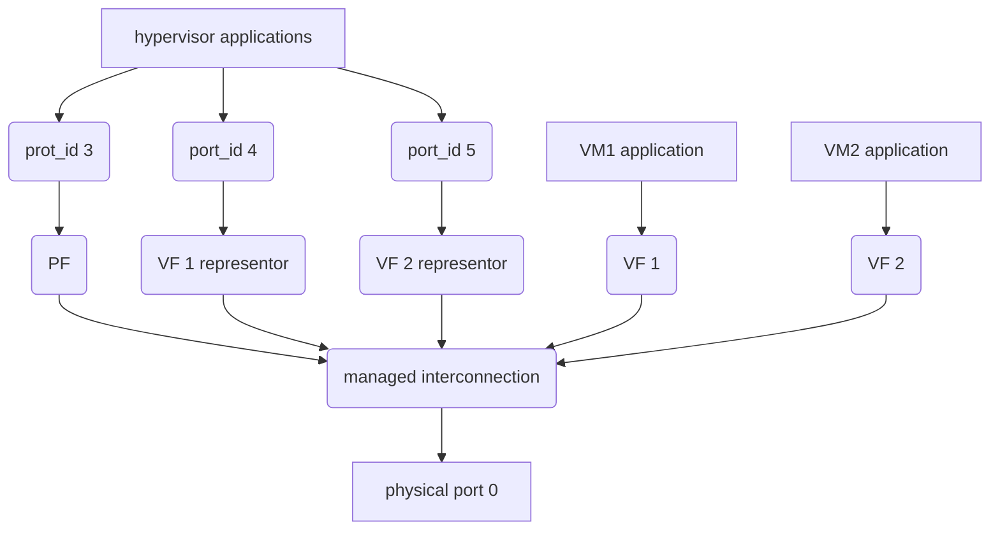

# vDPA

## 简介

在用户空间与 VM 进行信息传递的方法主要有两种，要么通过 SR-IOV，要么通过 virtIO。

物理端口（SR-IOV）可以和端口 representor 一起工作，representor 附加到 OVS 上，同时对应的 VF 直通到某个 VM 上。HW 规则可以从上行链路处理数据包，并将它们直接发送到 VF，而不需要通过 SW (OVS)。因此使用 SR-IOV 能够获得最好的性能。

但是，SR-IOV 架构要求 VM 使用特定于底层硬件的驱动，特定的 HW 驱动有两个缺陷：

1. 在某种意义上破坏了虚拟化(VM 知道 HW 的存在)。它还可以限制所支持的图像类型。
2. 对动态迁移支持较差。

使用 virtIO 端口可以解决上面两个问题。但是它会降低性能并丢失一些功能，例如，HW offload。为了解决这些冲突，一种新的网络设备类型被创建了——dpdkvdpa，新的网络设备与常规的 DPDK 设备类似，但引入了一些额外的功能。

dpdkvdpa 在物理端口（SR-IOV）和 virtIO 端口之间进行转发。将接收队列中的包转发到对应的发送队列，并且允许数据包从 virtIO (VM)传输到 VF，结合 SR-IOV 和 virtIO 的优点。



## 配置

1. 配置 vDPA 首先需要打开 SR-IOV，修改 BIOS 中 SR-IOV 设置，通常这个设置在 PCI 选项下。

2. 安装 MLNX_OFED，从[官方](https://cn.mellanox.com/products/infiniband-drivers/linux/mlnx_ofed)下载对应版本的MLNX_OFE

   ```bash
   $ tar -xvf MLNX_OFED_LINUX-5.1-2.3.7.1-rhel7.6-x86_64.tgz
   $ cd MLNX_OFED_LINUX-5.1-2.3.7.1-rhel7.6-x86_64
   $ ./mlnxofedinstall --ovs-dpdk --upstream-libs --add-kernel-support
   ```

3. 检查 SR-IOV 是否开启，必要时也可通过`mlxconfig`修改对应的项：

   ```bash
   $ mlxconfig -d /dev/mst/mt4119_pciconf0 q
   
   Device #1:
   ----------
   
   Device type:    ConnectX5
   Name:           MCX512A-ACA_Ax_Bx
   Description:    ConnectX-5 EN network interface card; 10/25GbE dual-port SFP28; PCIe3.0 x8; tall bracket; ROHS R6
   Device:         /dev/mst/mt4119_pciconf0
   
   Configurations:                              Next Boot
            SRIOV_EN                            True(1)
            NUM_OF_VFS                          8
            ...                                 ...
   $ mlxconfig -d /dev/mst/mt4119_pciconf0 set SRIOV_EN=1 NUM_OF_VFS=16
   ```

   **注意：**如果看不到/dev/mst 设备，执行一下 mst start 命令，[参考](https://community.mellanox.com/s/article/getting-started-with-mellanox-firmware-tools--mft--for-linux)

4. 重启服务器，切割网卡

   ```bash
   $ cat /sys/class/net/enp101s0f0/device/sriov_totalvfs
   $ echo 2 > /sys/class/net/enp101s0f0/device/sriov_numvfs
   $ echo 2 > /sys/class/net/enp101s0f1/device/sriov_numvfs
   ```

5. unbind vfs

   ```bash
   # 首先查看vf的BDF（bus device function）
   $ lspci | grep net
   04:00.0 Ethernet controller: Intel Corporation I210 Gigabit Network Connection (rev 03)
   05:00.0 Ethernet controller: Intel Corporation I210 Gigabit Network Connection (rev 03)
   65:00.0 Ethernet controller: Mellanox Technologies MT27800 Family [ConnectX-5]
   65:00.1 Ethernet controller: Mellanox Technologies MT27800 Family [ConnectX-5]
   65:00.2 Ethernet controller: Mellanox Technologies MT27800 Family [ConnectX-5 Virtual Function]
   65:00.3 Ethernet controller: Mellanox Technologies MT27800 Family [ConnectX-5 Virtual Function]
   65:01.2 Ethernet controller: Mellanox Technologies MT27800 Family [ConnectX-5 Virtual Function]
   65:01.3 Ethernet controller: Mellanox Technologies MT27800 Family [ConnectX-5 Virtual Function]
   # 可以看到[ConnectX-5 Virtual Function]为vf，若要详细查看，可使用ethtool -i选项
   $ echo 0000:18:00.2 > /sys/bus/pci/drivers/mlx5_core/unbind
   $ echo 0000:18:00.3 > /sys/bus/pci/drivers/mlx5_core/unbind
   $ echo 0000:18:01.2 > /sys/bus/pci/drivers/mlx5_core/unbind
   $ echo 0000:18:01.3 > /sys/bus/pci/drivers/mlx5_core/unbind
   ```

6. 将 e-switch 的模式切换为`switchdev`，此时会出现 vf representor

   ```bash
   $ echo switchdev > /sys/class/net/enp101s0f0/compat/devlink/mode
   $ echo switchdev > /sys/class/net/enp101s0f1/compat/devlink/mode
   # 使用ip a命令查看网络设备，会发现自动生成了几个vf representor
   $ ip a | grep enp101
   14: enp101s0f0_0: <BROADCAST,MULTICAST,UP,LOWER_UP> mtu 1500 qdisc mq state UP group default qlen 1000
   15: enp101s0f0_1: <BROADCAST,MULTICAST,UP,LOWER_UP> mtu 1500 qdisc mq state UP group default qlen 1000
   18: enp101s0f1_0: <BROADCAST,MULTICAST,UP,LOWER_UP> mtu 1500 qdisc mq state UP group default qlen 1000
   19: enp101s0f1_1: <BROADCAST,MULTICAST,UP,LOWER_UP> mtu 1500 qdisc mq state UP group default qlen 1000
   ```

7. bind vfs

   ```bash
   $ echo 0000:18:00.2 > /sys/bus/pci/drivers/mlx5_core/bind
   $ echo 0000:18:00.3 > /sys/bus/pci/drivers/mlx5_core/bind
   $ echo 0000:18:01.2 > /sys/bus/pci/drivers/mlx5_core/bind
   $ echo 0000:18:01.3 > /sys/bus/pci/drivers/mlx5_core/bind
   ```

8. 启动 Open vSwitch 服务

   ```bash
   $ systemctl restart openvswitch
   ```

9. 设置数据库，开启 hardware offload

   ```bash
   $ ovs-vsctl --no-wait set Open_vSwitch . other_config:dpdk-init=true
   $ ovs-vsctl set Open_vSwitch . other_config:hw-offload=true
   ```

10. 配置 DPDK 白名单

    ```bash
    $ ovs-vsctl --no-wait set Open_vSwitch . other_config:dpdk-extra="-w 0000:18:00.0,representor=[0,1],dv_flow_en=1,dv_esw_en=1,dv_xmeta_en=1 -w 0000:18:00.1,representor=[0,1],dv_flow_en=1,dv_esw_en=1,dv_xmeta_en=1"
    ```

    **注意：**representor 中填写对应的编号，填写[0,N]，代表将从 0 到 N 的 representor 都加入白名单。

11. 重启 Open vSwitch 服务，需要重启才能够使 HW offload 修改生效

    ```bash
    $ systemctl restart openvswitch
    ```

12. 创建 OVS-DPDK bridge，添加 PF

    ```bash
    $ ovs-vsctl add-br br0-ovs -- set bridge br0-ovs datapath_type=netdev
    $ ovs-vsctl add-br br1-ovs -- set bridge br1-ovs datapath_type=netdev
    $ ovs-vsctl add-port br0-ovs pf0 -- set Interface pf0 type=dpdk options:dpdk-devargs=0000:18:00.0
    $ ovs-vsctl add-port br1-ovs pf1 -- set Interface pf1 type=dpdk options:dpdk-devargs=0000:18:00.1
    ```

13. 添加 vDPA 端口到 bridge

    ```bash 
    $ ovs-vsctl add-port br0-ovs vdpa0 -- set Interface vdpa0 type=dpdkvdpa options:vdpa-socket-path=/var/run/virtio-forwarder/sock0 options:vdpa-accelerator-devargs=0000:18:00.2 options:dpdk-devargs=0000:18:00.0,representor=[0] options:vdpa-max-queues=8
    $ ovs-vsctl add-port br0-ovs vdpa1 -- set Interface vdpa1 type=dpdkvdpa options:vdpa-socket-path=/var/run/virtio-forwarder/sock1 options:vdpa-accelerator-devargs=0000:18:00.3 options:dpdk-devargs=0000:18:00.0,representor=[1] options:vdpa-max-queues=8
    $ ovs-vsctl add-port br1-ovs vdpa2 -- set Interface vdpa2 type=dpdkvdpa options:vdpa-socket-path=/var/run/virtio-forwarder/sock2 options:vdpa-accelerator-devargs=0000:18:01.2 options:dpdk-devargs=0000:18:00.1,representor=[0] options:vdpa-max-queues=8
    $ ovs-vsctl add-port br1-ovs vdpa3 -- set Interface vdpa3 type=dpdkvdpa options:vdpa-socket-path=/var/run/virtio-forwarder/sock3 options:vdpa-accelerator-devargs=0000:18:01.3 options:dpdk-devargs=0000:18:00.1,representor=[1] options:vdpa-max-queues=8
    ```

    **注意：**这里要特别注意对应的 vf 和 vf representor 的 pci 号，如果不确定就用 ethtool 查看一下。

14. Hardware vDPA 是默认开启的，如果硬件不支持，驱动会自动使用 Software vDPA，查看 vDPA 模式可运行命令：

    ```bash
    $ ovs-ofctl -O OpenFlow14 dump-ports br0-ovs
    OFPST_PORT reply (OF1.4) (xid=0x2): 4 ports
      port  vdpa1: rx pkts=0, bytes=0, drop=0, errs=0, frame=?, over=?, crc=?
               tx pkts=109364229, bytes=6561853864, drop=0, errs=0, coll=?
               duration=68007.137s
               CUSTOM Statistics
                          HW mode=0, ...
      port  pf: rx pkts=109366400, bytes=6561984080, drop=0, errs=0, frame=?, over=?, crc=?
               tx pkts=85, bytes=4812, drop=0, errs=0, coll=?
               duration=68007.530s
               CUSTOM Statistics
                          ovs_tx_failure_drops=0, ...
      port LOCAL: rx pkts=0, bytes=0, drop=0, errs=0, frame=0, over=0, crc=0
               tx pkts=0, bytes=0, drop=109364229, errs=0, coll=0
               duration=68008.787s
      port  vdpa0: rx pkts=85, bytes=4812, drop=0, errs=0, frame=?, over=?, crc=?
               tx pkts=109366400, bytes=6561984080, drop=0, errs=0, coll=?
               duration=68007.675s
               CUSTOM Statistics
                          HW mode=0, ...
    # 查看vdpa port中 HW mode 标志，由于我们使用的是ConnectX-5不支持Hardware vDPA，因此显示为0。
    ```

15. 查看端口配置

    ```bash
    # 完成所有配置之后查看当前配置情况，重启ovs-ctl
    $ ovs-vsctl show
    4a2a6ed5-c59f-4e8a-b922-f54d07efc5ba
        Bridge br0-ovs
            datapath_type: netdev
            Port vdpa0
                Interface vdpa0
                    type: dpdkvdpa
                    options: {dpdk-devargs="0000:18:00.0,representor=[0]", vdpa-accelerator-devargs="0000:18:00.2", vdpa-max-queues="8", vdpa-socket-path="/var/run/virtio-forwarder/sock0"}
            Port br0-ovs
                Interface br0-ovs
                    type: internal
            Port vdpa1
                Interface vdpa1
                    type: dpdkvdpa
                    options: {dpdk-devargs="0000:18:00.0,representor=[1]", vdpa-accelerator-devargs="0000:18:00.3", vdpa-max-queues="8", vdpa-socket-path="/var/run/virtio-forwarder/sock1"}
            Port pf
                Interface pf
                    type: dpdk
                    options: {dpdk-devargs="0000:18:00.0"}
        Bridge br1-ovs
            datapath_type: netdev
            Port br1-ovs
                Interface br1-ovs
                    type: internal
            Port vdpa2
                Interface vdpa2
                    type: dpdkvdpa
                    options: {dpdk-devargs="0000:18:00.1,representor=[0]", vdpa-accelerator-devargs="0000:18:01.2", vdpa-max-queues="8", vdpa-socket-path="/var/run/virtio-forwarder/sock2"}
            Port pf1
                Interface pf1
                    type: dpdk
                    options: {dpdk-devargs="0000:18:00.1"}
            Port vdpa3
                Interface vdpa3
                    type: dpdkvdpa
                    options: {dpdk-devargs="0000:18:00.1,representor=[1]", vdpa-accelerator-devargs="0000:18:01.3", vdpa-max-queues="8", vdpa-socket-path="/var/run/virtio-forwarder/sock3"}
        ovs_version: "2.13.1"
    $ /usr/share/openvswitch/scripts/ovs-ctl restart
    Saving flows                                               [  OK  ]
    Exiting ovsdb-server (342263)                              [  OK  ]
    Starting ovsdb-server                                      [  OK  ]
    system ID not configured, please use --system-id ... failed!
    Configuring Open vSwitch system IDs                        [  OK  ]
    Exiting ovs-vswitchd (342443)                              [  OK  ]
    Starting ovs-vswitchd                                      [  OK  ]
    Restoring saved flows                                      [  OK  ]
    Enabling remote OVSDB managers                             [  OK  ] 
    ```

## trex 测试

使用 trex 对 Mellanox 网卡进行测试有一些需要注意的地方，更新更详细的内容可以参考 trex 官方的[Mellanox support](https://trex-tgn.cisco.com/trex/doc/trex_appendix_mellanox.html)

### 测试环境

1. 两台安装了 Mellanox ConnectX-5 的物理机，物理机 A 上运行虚拟机作为 DUT，一台物理机 B 作为 Trex 测试仪；

2. 将 A 安装为 ZStack 管理节点，添加物理机 B 为计算节点；
3. 在 ZStack 管理平台上为 A、B 打开 iommu，并且开启大页内存；

3. 重启 A、B 物理机，修改 BIOS，开启 SRIOV 支持。

4. 按照上文中提到的方式为 A 物理机配置 vDPA，在 A 物理机上创建虚拟机 vm，并修改虚拟机配置：

   ```bash
   # 为虚拟机添加两个interface，类型为vhost-user
   $ virsh edit **VM_UUID**
   ```

   ```xml
     <!-->注意这里需要将memAccess设置为shared<!-->
     <cpu mode='host-passthrough' check='none'>
       <topology sockets='1' cores='8' threads='1'/>
       <numa>
         <cell id='0' cpus='0-7' memory='8388608' unit='KiB' memAccess='shared'/>
       </numa>
     </cpu>
   ...
       <!-->mode需要设置为server<!-->
       <interface type='vhostuser'>
         <mac address='6a:08:e8:fc:90:8f'/>
         <source type='unix' path='/var/run/virtio-forwarder/sock0' mode='server'/>
         <model type='virtio'/>
         <driver queues='16'/>
         <alias name='net1'/>
         <address type='pci' domain='0x0000' bus='0x00' slot='0x16' function='0x0'/>
       </interface>
       <interface type='vhostuser'>
         <mac address='de:18:fa:29:86:84'/>
         <source type='unix' path='/var/run/virtio-forwarder/sock2' mode='server'/>
         <model type='virtio'/>
         <driver queues='16'/>
         <alias name='net2'/>
         <address type='pci' domain='0x0000' bus='0x00' slot='0x17' function='0x0'/>
       </interface>
   ```

   正常启动虚拟机后应能在虚拟机中查看到新添加的两个网卡。

5. 在物理机 B 上配置 trex，CentOS7.6 需要使用对应的**OFED 4.6-1.0.1**，否则可能会无法正常运行。将 2M 大页关闭，开启 1G 的大页，（注意即便是同样大小的 2M 大页也会出 bug，必须开 1G）

   ```bash
   $ tar xvf MLNX_OFED_LINUX-4.6-1.0.1.1-rhel7.6-x86_64.tgz
   $ cd MLNX_OFED_LINUX-4.6-1.0.1.1-rhel7.6-x86_64
   $ ./mlnxofedinstall --with-mft --with-mstflint --dpdk --upstream-libs
   $ echo 0 > /sys/kernel/mm/hugepages/hugepages-2048kB/nr_hugepages
   $ echo 16 > /sys/kernel/mm/hugepages/hugepages-1048576kB/nr_hugepages
   ```

6. 设置`/etc/trex.cfg`

   ```plain
   - port_limit      : 2
     version         : 2
   #List of interfaces. Change to suit your setup. Use ./dpdk_setup_ports.py -s to see available options
     interfaces    : ["65:00.0","65:00.1"]
     port_info       :  # Port IPs. Change to suit your needs. In case of loopback, you can leave as is.
               - ip         : 192.168.155.2
                 default_gw : 192.168.155.3
               - ip         : 192.168.166.4
                 default_gw : 192.168.166.5
   ```

7. 在 vm 上修改脚本`dut.sh`，替换 mac 信息。

   ```bash
   ip link set dev eth1 up
   ip link set dev eth2 up
   ip a add 192.168.155.3/24 dev eth1
   ip a add 192.168.166.5/24 dev eth2
   ip r add 16.0.0.0/8 via 192.168.155.2
   ip r add 48.0.0.0/8 via 192.168.166.4
   # 替换此处mac信息
   ip n add 192.168.155.2 dev eth1 lladdr 04:3f:72:ae:3c:c2
   ip n add 192.168.166.4 dev eth2 lladdr 04:3f:72:ae:3c:c3
   echo 1 > /proc/sys/net/ipv4/ip_forward
   ```

8. 运行测试

   ```bash
   $ ./t-rex-64 -f cap2/imix_wuxia_10w.yaml -m 35 -d 60
   ```

9. 在虚拟机上安装 vpp 并进行测试，使用脚本`dut_vpp_set.sh`：

   ```bash
   echo -e "unix {
     nodaemon
     log /var/log/vpp/vpp.log
     full-coredump
     cli-listen /run/vpp/cli.sock
     gid vpp
   }
   api-trace {
     on
   }
   api-segment {
     gid vpp
   }
   socksvr {
     default
   }
   cpu {
     workers 6
   }
   plugins {
     plugin dpdk_plugin.so { enable }
   }
   dpdk {
           dev 0000:00:16.0
           dev 0000:00:17.0
           dev default {
                   num-rx-queues 4
   
                   num-tx-queues 4
           }
   }
   ">/etc/vpp/startup.conf
   systemctl restart vpp
   vppctl set int state GigabitEthernet0/16/0 up
   vppctl set int state GigabitEthernet0/17/0 up
   vppctl set int ip address GigabitEthernet0/16/0 192.168.155.3/24
   vppctl set int ip address GigabitEthernet0/17/0 192.168.166.5/24
   vppctl ip r add 16.0.0.0/8 via 192.168.155.2
   vppctl ip r add 48.0.0.0/8 via 192.168.166.4
   vppctl set ip arp GigabitEthernet0/16/0 192.168.155.2 6a:08:e9:ac:90:8f
   vppctl set ip arp GigabitEthernet0/17/0 192.168.166.4 de:18:ff:19:86:84
   echo 1 > /proc/sys/net/ipv4/ip_forward
   ```

## 测试结果

300wpps