# OVS-kernel vlan offloads 

在 kernel 协议栈下使用 ovs vlan 很简单，只需要对指定的端口设置 tag 即可，如：

```bash
$ ovs-vsctl set Port vDPA0 tag=12
```

> 注意，不要给 PF 端口设置 VLAN，否则所有经过该 PF 下的流量都会被设置 VLAN，即所有该 PF 下的 VF 都会受影响。

对 host0 和 host1 分别做如下配置：

```bash
# in host0
$ ovs-vsctl set Port vDPA1 tag=12

# in host1
$ ovs-vsctl set Port vDPA0 tag=12
```

以 host0 做服务端、host1 做客户端，进行 iperf3 测试：

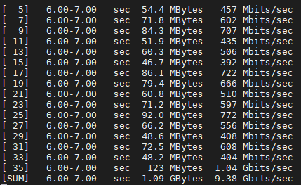

带宽打满了约 9Gbits/s。此时 host1 上 dump-flow 情况如下：

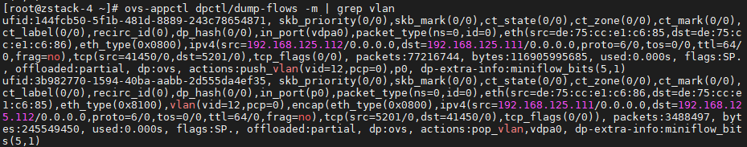

可见流量从 vdpa0 到 ovs，actions push_vlan，打上 vlan tag 12，从 p0 口送出；从 p0 返回的流量带有 vlan tag，action pop_vlan，移除 tag，并送到 vdpa0 口。注意此使的 offloaded 为 partial。pmd 使用情况如下：

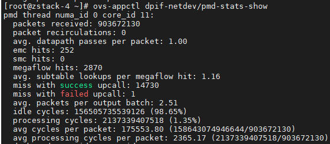

# OVS-kernel vxlan offloads 

在使用 ovs-kernel 做 vxlan 的时候需要注意，不要将 pf 当作 port 加载到 ovs 上，需要在 pf 上配置 ip，用于封装 vxlan。

```bash
$ ip addr add 1.1.1.177/24 dev enp4s0f1
$ ovs-vsctl add-port ovs-sriov vxlan0 -- set interface vxlan0 type=vxlan options:local_ip=1.1.1.177 options:remote_ip=1.1.1.75 options:key=98
```

```bash
$ ip addr add 1.1.1.75/24 dev enp4s0f1
$ ovs-vsctl add-port ovs-sriov vxlan0 -- set interface vxlan0 type=vxlan options:local_ip=1.1.1.75 options:remote_ip=1.1.1.177 options:key=98
```

**VF 必须减少 MTU，以允许主机/HW 添加 encap 报头， 从而不分割产生的包。VF 的 MTU 必须降至 IPv4 为 1450，IPv6 为 1430**

# OVS-DPDK vxlan offloads

ovs-dpdk vxlan 的配置思路与 ovs-kernel vxlan 的配置思路基本相同，首先配置一个 br-ovs 网桥，在这个网桥上添加 vDPA port 和 vxlan tunnel port；借助 kernel 的路由和 arp 解析功能，将 pf 配置成 VTEP，与 ovs-kernel 不同的是，我们要为 pf 创建一个新的网桥 br-phy，并将 pf 以 dpdk 模式挂到 br-phy 下。

> vSwitch in userspace rather than kernel-based Open vSwitch requires an additional bridge. The
> purpose of this bridge is to allow use of the kernel network stack for routing and ARP resolution.
> The datapath needs to look-up the routing table and ARP table to prepare the tunnel header and
> transmit data to the output port.  

1. 配置 br-ovs 网桥和 vDPA

   ```bash
   $ ovs-vsctl add-br br-ovs -- set Bridge br-ovs datapath_type=netdev -- br-set-external-id br-ovs bridge-id br-ovs -- set bridge br-ovs fail-mode=standalone
   $ ovs-vsctl add-port br-ovs vdpa0 -- set Interface vdpa0 type=dpdkvdpa options:vdpa-socket-path=/var/run/virtio-forwarder/sock0 options:vdpa-accelerator-devargs=0000:18:00.2 options:dpdk-devargs=0000:18:00.0,representor=[0] options:vdpa-max-queues=8
   ```

2. 配置 vxlan tunnel port

   ```bash
   $ ovs-vsctl add-port br-ovs vxlan0 -- set interface vxlan0 type=vxlan options:local_ip=56.56.67.1 options:remote_ip=56.56.68.1 options:key=45 options:dst_port=4789
   ```

3. 配置 br-phy 网桥

   ```bash
   $ ovs-vsctl add-br br-phy -- set Bridge br-phy datapath_type=netdev -- br-set-external-id br-phy bridge-id br-phy -- set bridge br-phy fail-mode=standalone other_config:hwaddr=04:3f:72:ae:3c:ca
   # 注意上面的hwaddr需要填写为对应pf的mac地址
   $ ovs-vsctl add-port br-phy p0 -- set Interface p0 type=dpdk options:dpdk-devargs=0000:18:00.0
   ```

4. 设置 br-phy 网桥

   ```bash
   $ ip addr add 56.56.67.1/24 dev br-phy
   $ ip link set br-phy up
   $ ip link set enp24s0f0 up
   ```

> 注意：若使用时出现**netdev_dpdk(pmd-c11/id:6)|WARN|p0: Too big size 1564 max_packet_len 1518**报错，这是由于添加了 vxlan 报文后帧变大了，需要修改 MTU 值。

## iperf3 测试

使用用户空间的 vSwitch 需要一个额外的 bridge，这个 bridge 的目的是为了能够使用内核网络协议栈来进行路由和 arp。datapath 需要查找路由表和 ARP 表来准备隧道头并将数据传输到输出端口。

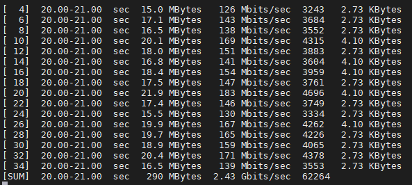

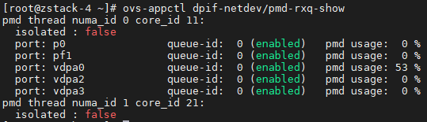

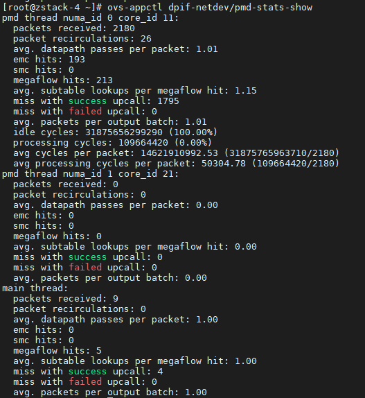

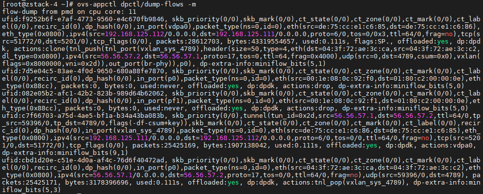

由上图可看到 vxlan offload 成功，rxq 显示 pmd usage 为 53%， 但是 pmd-stat-show 命令查看 processing cycles 为 0%；同时 pmd usage 的压力在 vdpa0。使用 iperf3 测试时，开 16 进程带宽为 2.43Gbits/sec，增加进程数，带宽会继续增加，126 个进程时为 5.81Gbits/sec，1 进程时为 400Mbits/sec。

## trex 测试

单边 vxlan trex 测试，所有 flow offload，pmd-stat-show 命令查看 processing cycles 为 0%；rxq 显示 pmd usage：

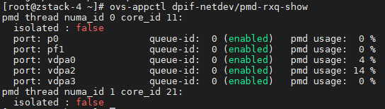

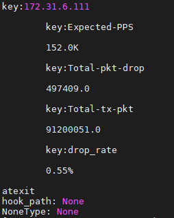

使用自动化脚本测试结果如上图，0.5%丢包约为 15wpps。

# testpmd 测试

在虚拟机中安装 test-pmd，加

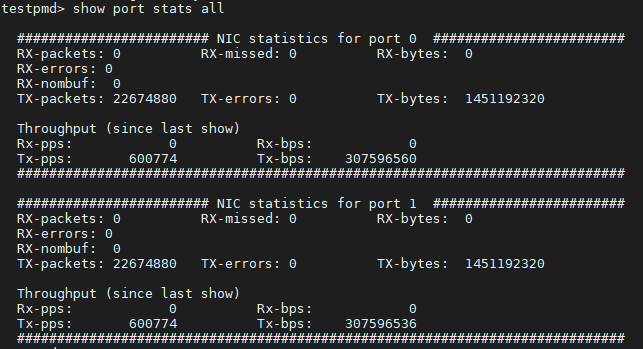

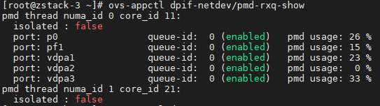

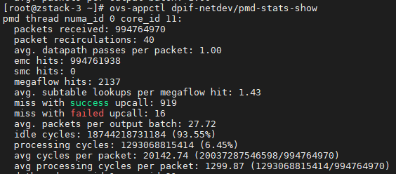

在纯发包（txonly)模式下，vxlan 与 vlan 的发包速率相同在 50wpps 左右

指定对应 vxlan 的网卡，纯发包（txonly)模式下：

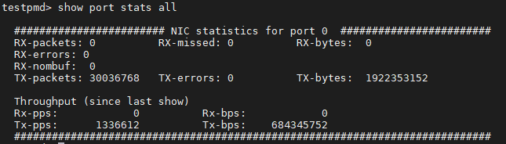

指定 vlan 网卡，纯发包（txonly)模式下

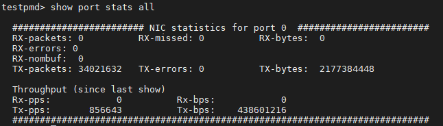

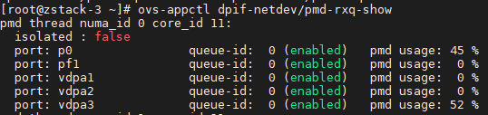

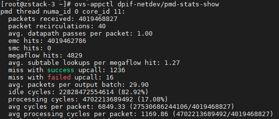

# cpu tunning

cpu pin 了之后，vxlan:

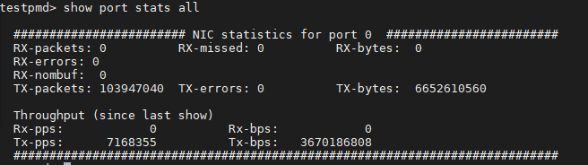

vlan:

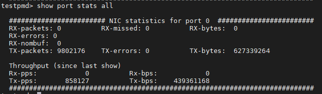

vlan+vxlan

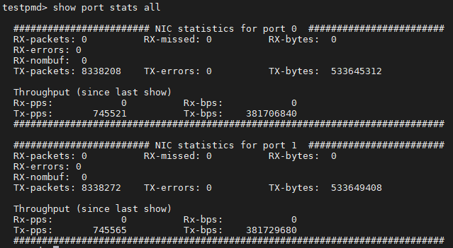

移除 vlan tag：


**修正**：使用 dump-flow 查看流的状态为 vxlan 时，实际 txonly 为 250wpps 左右；之前 700wpps 时 dump-flow 查看流的状态


# trex 单虚拟机测试

normal: 0.5%丢包 385wpps(达到了 trex 的极限，cpu 99.9%)

vxlan: 0.5%丢包 146wpps，将直接转发 vxlan0->pf1，改为发送到虚拟机（testpmd），可测出 300wpps，

vlan: 0.5%丢包 310wpps

设置 vlan 的，openflow 规则：

```bash
$ ovs-ofctl add-flow br-ovs "table=0,priority=20,ip,in_port=pf0,nw_dst=48.0.0.0/8 actions=output:pf1"
```

# Reference

https://docs.openvswitch.org/en/latest/howto/userspace-tunneling/