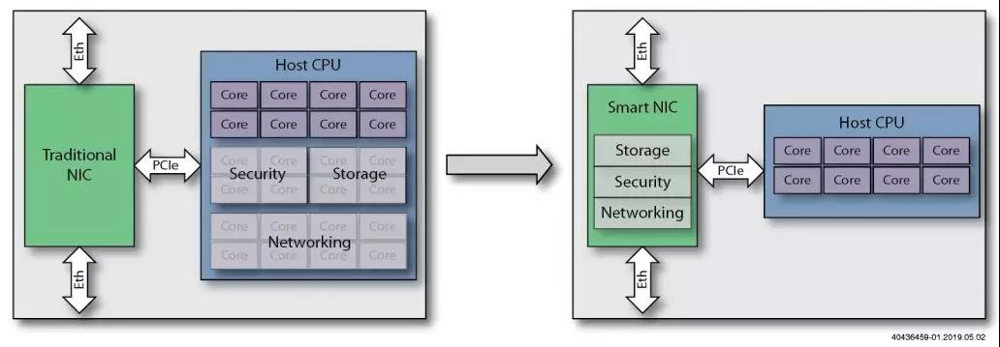

*”如果一件事情自己干不完，那就把它丢给小弟干，如果还干不完，那就再找几个小弟。”*

​																																		*——塞皮尤*

# 概述

目前的数据中心、云计算都十分依赖网络服务的性能，为了提高网络 I/O 性能，工程师想出了各种各样的办法，例如使用 DPDK 绕过内核网络协议栈，直接将数据引入 CPU LLC(DDIO)，减少 CPU 内核之间的缓存争用，降低中断频率（中断调制）。但是，这些方法要么就是延迟换 I/O，要么就是消耗大量的 CPU 算力。

通常的网卡只负责处理数据链路层和物理层，由 CPU 负责处理网络协议栈中更高层的逻辑。CPU 负责网络层、传输层数据的封装和解封；网卡负责更底层数据链路层帧的封装和解封，以及物理层电气信号的相应处理。

智能网卡与一般的网卡区别在于，智能网卡上自带了一个处理器，CPU 可以将协议栈的处理 offload 到智能网卡上，解放 CPU 的处理能力。

目前的智能网卡有三种实现方式：

1. 多核智能网卡，基于包含多个 CPU 内核的 ASIC
2. 基于 FPGA 的智能网卡
3. FPGA 和 ASIC 结合的增强型智能网卡

智能网卡结合 RDMA 技术，可以直接跳过 CPU，将数据传到内存。

