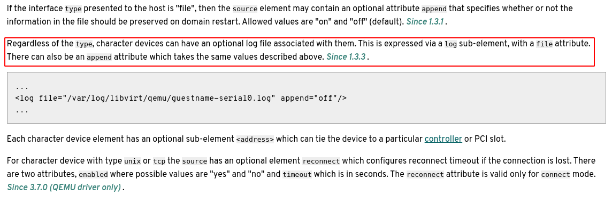
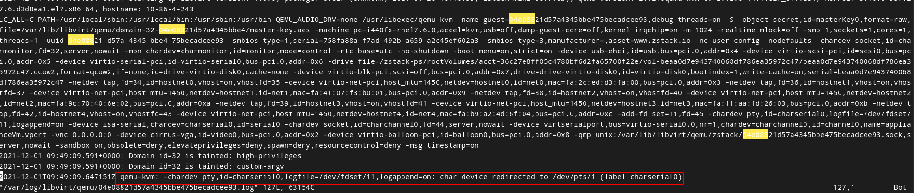

> 这篇博客要做的事情是，将虚拟机启动时的启动信息传到宿主机上的一个文件中。这个工作本身并不复杂，难点在于 virsh 中对串口设备的封装处理，以及 grub2 中的配置。

若想要好好理解 qemu 重定向串口的做法背后的原理和思想，非常建议先阅读第一章的预备知识。
<!-- more -->
# 1、预备知识

## 1.1、理解 qemu 中绑定设备的常规做法

在 qemu 中若要为虚拟机添加一个外部设备（虚拟网卡，块设备等），或者绑定某个串口到某个端口、文件或是虚拟终端，要首先做好两件工作：

1. 提供一个`host part`，这部分由宿主机提供，它可能是宿主机虚拟出来的一个网卡、宿主机上的一个块设备、一个文件、一个端口。选项根据不同的设备类型有`-drive`，`-chardev`等；
2. 一个`guest part`，这部分（一般是一些总线设备）可理解为连接`host part`的方式，同时可添加一些额外的配置。选项统一为`-device`。

> 注意：在较旧版本的 qemu 中，并没有将这两部分分开来，导致配置虚拟机的命令选项非常繁复；随着 qemu 中对各种虚拟设备的支持越来越完善，qemu 整理了所有设备的配置方式，给出了一个较为统一的模式。但是对旧的配置方式，qemu 还是支持的。

下面是一些配置例子：

1. Block Devices，template：

   ```plain
   -drive if=none,id=DRIVE-ID,HOST-OPTS...
   -device DEVNAME,drive=DRIVE-ID,DEV-OPTS...
   ```

   - **宿主机**角度来看，可以直接将某个文件（qcow2、iso 等）当作块设备直接提供给虚拟机；

   - **虚拟机**角度来看块设备的类型有：ide、scsi、floppy、virtio、usb-storage。

   ```plain
   -drive file=/xx.qcow2,format=qcow2,if=none,id=dirve-virtio-disk0,cache=none
   -device virtio-blk-pci,scsi=off,bus=pci.0,addr=0xa,drive=drive-virtio-disk0,id=virtio-disk0,bootindex=1,write-cache=on
   ```

   在这个配置中，我们将一个**宿主机**上的一个 qcow2 文件通过 virtio 的方式提供给**虚拟机**。在**虚拟机**中将从 virtio 总线上获得这个设备。

   > 注意：qemu 在解析选项时，对所有`-device`选项（该选项一般都是一些总线）是一视同仁的，在解析选项时，首先通过后面指定的`virtio-blk-pci`确定该 device 的类型，然后再通过`drive=drive-virtio-disk0`为这个 device 找到对应的设备。

2. Char Devices，template：

   ```plain
   -chardev HOST-OPTS...,id=CHR-ID
   -device DEVNAME,chardev=CHR-ID,DEV-OPTS...
   ```

   - **宿主机**的角度来看，可以将 file、tty、鼠标、键盘、stdio、vc、pipe 等作为字符设备提供给虚拟机；
   - **虚拟机**的角度来看，可以用 serial、parallel、usb、virtio 去连接这个外部的设备。

   ```plain
   -chardev pty,id=charserial0 
   -device isa-serial,chardev=charserial0,id=serial0 
   
   -add-fd set=3,fd=36 
   -chardev file,id=charserial1,path=/dev/fdset/3,append=on 
   -device isa-serial,chardev=charserial1,id=serial1  
   ```

   上面的两个例子都是使用 isa-serial 串口线，一个连接到 pty，一个连接到 fd 为 36 的文件上。

3. Network Devices，template:

   ```plain
   -netdev HOST-OPTS...,id=NET-ID
   -device DEVNAME,netdev=NET-ID,mac=MACADDR,DEV-OPTS...
   ```

   - **宿主机**的角度来看，可以将虚拟出来的网络设备提供给虚拟机；
   - **虚拟机**的角度来看，可以用 pci 去连接这个外部的设备。

   ```plain
   -netdev tap,fd=33,id=hostnet0,vhost=on,vhostfd=34 
   -device virtio-netpci,host_mtu=1500,netdev=hostnet0,id=net0,mac=fa:7b:57:5a:43:00,bus=pci.0,addr=0x3
   ```

   将 fd=33 的虚拟 tap 通过 virtio-netpci 分配给虚拟机。

## 1.2、理解 console、tty 和 ttyS

太长，不赘述：https://www.zhihu.com/question/65280843

# 2、解决方案

问题：要将虚拟机启动时的 boot 信息输出到宿主机上的任意文件中。

1. 想要获得虚拟机启动的 boot 信息，需要为内核参数添加 boot 信息输出，并将 boot 信息输出定向到 ttyS 上。

2. ttyS 为 serial console，我们可以为虚拟机增加一个串口输出，并将串口输出定向到宿主机文件中。

# 3、配置 grub

配置 grub 文件，先下载一份[grub.pdf](https://www.gnu.org/software/grub/grub-documentation.html)作为参考手册。

打开`/etc/default/grub`

```bash
$ vim /etc/default/grub
GRUB_TIMEOUT=5
GRUB_DISTRIBUTOR="$(sed 's, release .*$,,g' /etc/system-release)"
GRUB_DEFAULT=saved
GRUB_DISABLE_SUBMENU=true
GRUB_SERIAL_COMMAND="serial --speed=115200 --unit=0 --port=0 --word=8 --parity=nn
o --stop=1"
GRUB_TERMINAL_OUTPUT="console serial"
GRUB_CMDLINE_LINUX_DEFAULT="console=ttyS0,115200n8 console=ttyS1,115200n8 consoll
e=tty1"
#GRUB_CMDLINE_LINUX="crashkernel=auto rd.lvm.lv=centos/root rd.lvm.lv=centos/swaa
p rhgb quiet"
GRUB_DISABLE_RECOVERY="true"
```

注释掉`GRUB_CMDLINE_LINUX`，它的 quiet 选项将导致 boot 信息不输出。

在`GRUB_TERMINAL_OUTPUT`中添加 serial，这样就可以通过 serial 输出。

添加`GRUB_CMDLINE_LINUX_DEFAULT`，将 console 定向到 ttyS0、ttyS1 和 tty1。

添加`GRUB_SERIAL_COMMAND`，设置串口属性。

使用 grub2-mkconfig 生成新的 grub.cfg 文件

```bash
$ grub2-mkconfig -o /boot/grub2/grub.cfg
```

**注意：这个 grub 配置依然是有问题的。**

# 4、修改虚拟机定义文件

直接使用 virsh 命令启动虚拟机，基本的虚拟机配置略。假设虚拟机名为 test。

```bash
$ virsh start test
```

设置虚拟机定义文件，重启虚拟机

```bash
$ virsh edit test
```

`<devices>`标签中添加如下：

```xml
    <serial type='pty'>
      <target type='isa-serial' port='0'>
        <model name='isa-serial'/>
      </target>
    </serial>
    <console type='pty'>
      <target type='serial' port='0'/>
    </console>
```

重启 test，通过 virsh console（事实上，virsh console 是通过 console 配置中所绑定的 tty 来查看 test 虚拟机的）查看 test。

```bash
$ virsh reboot test
$ virsh console test
```

此时能看到虚拟机启动打印的日志，再添加如下：

```xml
    <serial type='file'>
      <source path='/var/log/libvirt/qemu/test.log'/>
      <target type='isa-serial' port='1'>
        <model name='isa-serial'/>
      </target>
    </serial>
```

重启后应能在`/var/log/libvirt/qemu/test.log`文件中看到 boot 信息。

> 注意：这里有一些小问题，事实上在`<target>`标签中指定的 port 是无效的（或许这个 port 不是我理解的意思，但是这个值对生成的 qemu 命令并无影响），libvirt 实际解析的时候会按照先后顺序给 file 和 pty 分配串口号。并且由于 libvirt console 的问题，`<serial type='file'>`最好放在`<serial type='pty'>`之后，否则`<console>`标签就会变成 file 类型，从文件中输出。而我们并不想影响 virsh console 的功能。

我们在配置 grub 的时候，指定了 serial console 使用的 port 为 0 和 1，若我们只指定 0，那么 grub 不会往串口 1 输出 boot 信息，也就是说无法输出到日志。若只指定 1，那么 grub 不会往串口 0 输出 boot 信息，virsh console 无法使用。

这是理想的结果，但是，在实际的操作中，grub 只会给`GRUB_CMDLINE_LINUX_DEFAULT`中先设置的 ttyS 发送 boot 信息，而第二个设置的这无法输出，交换这两个配置，可以获得相反的结果。目前若想要输出到文件则 virsh console 不可用。

```bash
GRUB_CMDLINE_LINUX_DEFAULT="console=ttyS0,115200n8 console=ttyS1,115200n8 consoll
e=tty1"
```

**补充：**在 Linux 内核文档`serial-console.rst`中有这么一段话：

```plain
Note that you can only define one console per device type (serial, video).
```

这意味这，我们只能使用一个 serial console 作为输出。。。

所以应该修改为：

```bash
$ vim /etc/default/grub
GRUB_TIMEOUT=5
GRUB_DISTRIBUTOR="$(sed 's, release .*$,,g' /etc/system-release)"
GRUB_DEFAULT=saved
GRUB_DISABLE_SUBMENU=true
GRUB_SERIAL_COMMAND="serial --speed=115200 --unit=0 --port=0 --word=8 --parity=nn
o --stop=1"
GRUB_TERMINAL_OUTPUT="console serial"
GRUB_CMDLINE_LINUX_DEFAULT="console=ttyS1,115200n8 consoll
e=tty1"
#GRUB_CMDLINE_LINUX="crashkernel=auto rd.lvm.lv=centos/root rd.lvm.lv=centos/swaa
p rhgb quiet"
GRUB_DISABLE_RECOVERY="true"
```

## 4.1 libvirt 历史残留的 console 问题

在`libvirt-4.9.0/src/conf/domain_conf.c`中`virDomainDefAddConsoleCOmpat`方法：

```c
static int
virDomainDefAddConsoleCompat(virDomainDefPtr def)
{
    /* ... */
       /*
     * Some really crazy backcompat stuff for consoles
     *
     * Historically the first (and only) '<console>' element in an HVM guest
     * was treated as being an alias for a <serial> device.
     *
     * So if we see that this console device should be a serial device, then we
     * move the config over to def->serials[0] (or discard it if that already
     * exists). However, given console can already be filled with aliased data
     * of def->serials[0]. Keep it then.
     *
     * We then fill def->consoles[0] with a stub just so we get sequencing
     * correct for consoles > 0
     */

    /* Only the first console (if there are any) can be of type serial,
     * verify that no other console is of type serial
     */ 
    
     /* ... */
    
     /* If there isn't a corresponding serial port:
         *  - create one and set, the console to be an alias for it
         *
         * If there is a corresponding serial port:
         * - Check if the source definition is equal:
         *    - if yes: leave it as-is
         *    - if no: change the console to be alias of the serial port
         */

        /* create the serial port definition from the console definition */
        if (def->nserials == 0) {
            if (VIR_APPEND_ELEMENT(def->serials,
                                   def->nserials,
                                   def->consoles[0]) < 0)
                return -1;

            /* modify it to be a serial port */
            def->serials[0]->deviceType = VIR_DOMAIN_CHR_DEVICE_TYPE_SERIAL;
            def->serials[0]->targetType = VIR_DOMAIN_CHR_SERIAL_TARGET_TYPE_NONE;
            def->serials[0]->target.port = 0;
        } else {
            /* if the console source doesn't match */
            if (!virDomainChrSourceDefIsEqual(def->serials[0]->source,
                                              def->consoles[0]->source)) {
                virDomainChrDefFree(def->consoles[0]);
                def->consoles[0] = NULL;
            }
        }

        if (!def->consoles[0]) {
            /* allocate a new console type for the stolen one */
            if (!(def->consoles[0] = virDomainChrDefNew(NULL)))
                return -1;

            /* Create an console alias for the serial port */
            def->consoles[0]->deviceType = VIR_DOMAIN_CHR_DEVICE_TYPE_CONSOLE;
            def->consoles[0]->targetType = VIR_DOMAIN_CHR_CONSOLE_TARGET_TYPE_SERIAL;
        }
  
     /* ... */
}
```

为了保证兼容，第一个 serial 的配置保留给了 console，所以，如果第一个配置的 serial 类型如果不是 pty，那么 virsh console 可能会有问题。因此，我们添加的 file 类型的串口输出需要放到 pty 配置的下面。。。。

# 5、最终解决方案

实际上有一种方法可以达到既能使用 virsh console 又能输出到本地文件。使用这种方法不需要开启两个serial，参考libvirt xml如下：



实际效果如下：



这种方法实际上使用的是同一个serial，因此不会有开多个serial的困扰。
