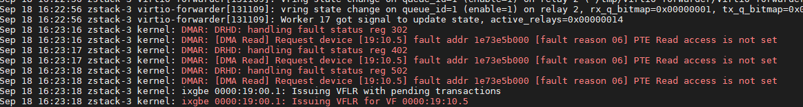

virtio-forwarder（VIO4WD）是一个用户空间网络应用，它可以在 SR-IOV virtual functions（VFs）和 QEMU 的 virtio 网络设备之间转发流量。virtio-forwarder 通过 DPDK 轮询模式驱动程序 (PMD) 机制，使用 DPDK 的 vhost-user 库和指定的 VFs 实现 virtio 后端驱动程序。

这意味着，virtio-forward 既采用了 DPDK 和 VFs 来保证网络性能，又通过添加中间层的方式解耦了和 QEMU 虚拟机网卡的绑定，提供了更高的灵活性。

>
> virtio-forwarder 使用 libdpdk 开发，因此 VIO4WD 是一个运行在用户空间的应用，同样的 QEMU 端只能够使用 vhost-user 模式。

VIO4WD 最多支持 64 个转发实例（即一个 VF<->virtio 对），VFs 接收到数据包，然后发送到对应的 virtio 后端，反之亦然。中继原理可以从 NICs 和 virtio 网络驱动程序提供的技术中获益。NIC 可以下放部分或全部网络功能，而 virtio 支持 VM 实时迁移，并且对底层硬件不可见。
<!-- more -->
# 系统要求

- 要求 QEMU 版本在 2.5 以上；
- 要求 libvirt 版本在 1.2.6 以上，如果直接使用 QEMU，就不需要 libvirt 了；
- 需要配置 2M 大页内存，并且有对应的挂载点，至少需要 1375 个空闲大页；
- 添加到中继层的 SR-IOV VFs 必须绑定到 igb_uio 驱动。

> 第 1、3、4 条要求必须严格遵守，第 2 条要求视是否使用 libvirt 管理虚拟机而定。
>
> 其中有两点需要注意：
>
> 1. 大页内存不可重复挂载到同一挂载点，否则 dpdk 会重复获取同一个挂载点的文件锁，然后死锁；
> 2. 如果你的机器存在多个 numa node，那么需要注意一下大页内存的分配方式。
>
> 下文对这两点有更详细的描述。

# DPDK 依赖

因为 virtio-forwarder 是一个基于 DPDK 开发的应用，因此需要 DPDK。

你可以使用包管理工具直接下载：

```bash
$ yum install dpdk dpdk-devel dpdk-tools
```

或者，你也可以选择从源码构建 DPDK：

```bash
$ git clone https://github.com/DPDK/dpdk.git
$ cd dpdk
$ meson -Dbuildtype=debug -Dexamples=all build
$ cd build
$ ninja
$ ninja install
$ ldconfig
```

> 注意：最新的 dpdk 使用 meson 和 ninja 作为构建工具，旧版本使用的是 make 工具。这里使用的是新的版本。

完成 libdpdk 的编译和安装之后，编译一个应用示例进行测试 [^ 1]：

```bash
# 将 dpdk.pc 添加到 pkg-config 路径下，否则无法找到 libdpdk
$ export PKG_CONFIG_PATH=$PKG_CONFIG_PATH:/usr/local/lib64/pkgconfig/
$ cd dpdk/examples/helloworld
$ meson build
$ cd build
$ ninja
$ ./helloworld -l 0-3 -n 4
```

由于 virtio-forwarder 要求使用 igb_uio 驱动，所以需要编译 igb_uio 驱动，并且导入模块。

```bash
$ meson configure -Dkernel_dir=/usr/lib/modules/3.10.0-957.el7.x86_64
$ ninja
$ modprob uio
$ insmod igb_uio.ko
```

# 配置大页

VIO4WD 需要使用 2M 的大页，并且需要有 1375 个空闲大页，而 QEMU/KVM 更倾向于使用 1G 的大页，为了能够一开始就分配好足够的大页，我们最好在 grub 中添加内核参数。

```bash
$ vim /etc/default/grub
# 内核参数中添加如下内容 hugepagesz=2M hugepages=1375 default_hugepagesz=1G hugepagesz=1G hugepages=8
$ grub2-mkconfig > /boot/grub2/grub.cfg
```

注意，要确保你系统拥有足够的内存映射：

```bash
$ cat /proc/sys/vm/max_map_count
# 若 max_map_count 数量不足则需修改
$ echo $num > /proc/sys/vm/max_map_count  # $num > 2 * nr_hugepages
```

设置挂载点：

```bash
grep hugetlbfs /proc/mounts | grep -q "pagesize=2M" || \
( mkdir -p /dev/hugepages && mount nodev -t hugetlbfs -o rw,pagesize=2M /dev/hugepages/ )
grep hugetlbfs /proc/mounts | grep -q "pagesize=1G" || \
( mkdir -p /dev/hugepages-1G && mount nodev -t hugetlbfs -o rw,pagesize=1G /dev/hugepages-1G/ )
```

如果使用了 libvirt，需要为 libvirt 创建好对应的目录：

```bash
$ mkdir /dev/hugepages-1G/libvirt
$ mkdir /dev/hugepages/libvirt
$ chown [libvirt-]qemu:kvm -R /dev/hugepages-1G/libvirt
$ chown [libvirt-]qemu:kvm -R /dev/hugepages/libvirt
```

> 注意几个细节：
>
> 1. 2M 大页的 pages 为 1375，这是在只有一个 numa 节点的情况下，如果你有多个 numa 节点（可通过 cpuinfo 查看），那么 2M 大页会平分到多个 numa 节点上 [^ 2]；VIO4WD 的默认策略会在一个 socket 上使用 1375*2MB 的内存，那么你就需要将 2M 大页的数量翻倍；
> 2. DPDK 通过`/proc/mount`判断挂载点，若在同一个路径下挂载两次（`/proc/mount`中会有两条记录），那么就会出现锁死的情况；以 CentOS7 为例，若向内核参数添加了大页内存支持，重启后会自动挂载一个`/dev/hugepages`，这时候你需要先卸载它，或者直接换一个地方挂载并在后续的`/etc/default/virtioforwarder`配置中修改即可。
> 3. 注意系统中 libvirt 的权限问题。
> 4. 在`/etc/default/grub`的内核参数中修改`intel_iommu=on`为`intel_iommu=pt`，否则会出现如下错误：
>
> 

# 从源码构建 virtio-forwarder

从 github 下载 virtio-forwarder 源码：

```bash
$ git clone https://github.com/Netronome/virtio-forwarder.git
$ cd virtio-forwarder
```

在源码目录尝试构建 virtio-forwarder：

```bash
$ make -j 4
```

若出现依赖错误，则需要安装对应的依赖，可能会使用到的依赖：

```bash
$ yum install epel-release
$ yum install protobuf-c-compiler protobuf-c-devel
$ yum install python2-sphinx python-sphinx_rtd_theme
$ yum install zeromq zeromq-devel
$ yum install protobuf-python python-zmq
```

完成构建之后会多出一个`build`目录：

```bash
$ ls build/
argv.o     dpdk_eal.o       ovsdb_mon.o  protobuf          virtio_forwarder_main.o  vrelay_version.h    zmq_server.o
_build     file_mon.o       pb2          sriov.o           virtio-forwarder.map     zmq_config.o        zmq_service.o
cmdline.o  log.o            _postbuild   ugid.o            virtio_vhostuser.o       zmq_core_sched.o    zmq_stats.o
cpuinfo.o  meson.build.out  _prebuild    virtio-forwarder  virtio_worker.o          zmq_port_control.o
```

安装 virtio-forwarder，会安装`startup/systemd/virtio-forwarder.service`：

```bash
$ make install
```

或者将其打包成 rpm，方便分发：

```bash
$ make rpm
```

# 修改 VIO4WD 配置

VIO4WD 配置文件在`/etc/defualt/virtioforwarder`，它是 virtio-forwarder.service`服务的启动参数，我们需要根据实际情况修改一下：

```bash
# vhost-user unix socket ownership username (leave blank to inherit process
# username)
VIRTIOFWD_SOCKET_OWNER=root

# vhost-user unix socket ownership groupname (leave blank to inherit process
# groupname)
VIRTIOFWD_SOCKET_GROUP=root

# ZeroMQ IPC endpoint used for configuration queries
VIRTIOFWD_ZMQ_CONFIG_EP=ipc:///var/run/virtio-forwarder/config
```

# 添加 VF 端口

向 virtio-forwarder 添加 VF 端口有多种方式，根据不同的使用情况，可使用方法是：

- ZeroMQ 端口控制：

  开启 zmq 端口控制需要设置`VIRTIOFWD_ZMQ_CONFIG_EP`，使用`/usr/lib64/virtio-forwarder/virtioforwarder_port_control.py`可以控制 VF、bond 和 socket pair。

- 静态 VF 记录：

  直接在配置文件中的`VIRTIOFWD_STATIC_VFS`中添加。

- OVSDB 监控器：

  略。

# 设置 CPU

负载均衡器和亲和性 [^ 3]。

略。

# 运行虚拟机

## QEMU 方式

通过 QEMU 方式直接运行，需在 QEMU 命令行后添加如下：

```bash
-object memory-backend-file,id=mem,size=3584M,mem-path=/dev/hugepages-1G,share=on,prealloc=on \
-numa node,memdev=mem -mem-prealloc \
-chardev socket,id=chr0,path=/tmp/virtio-forwarder1.sock \
-netdev type=vhost-user,id=guest3,chardev=chr0,vhostforce \
-device virtio-net-pci,netdev=guest3,csum=off,gso=off,guest_tso4=off,guest_tso6=off,\
guest_ecn=off,mac=00:03:02:03:04:01
```

或者使用 vhost-user Client 模式，只需要：

```bash
-chardev socket,id=charnet1,path=/tmp/virtio-forwarder1.sock,server
```

## libvirt 方式

在虚拟机定义文件中添加如下：

```bash
<memoryBacking>
  <hugepages>
    <page size='1048576' unit='KiB' nodeset='0'/>
  </hugepages>
</memoryBacking>

<cpu mode='custom' match='exact'>
  <model fallback='allow'>SandyBridge</model>
  <feature policy='require' name='ssse3'/>
  <numa>
    <cell id='0' cpus='0-1' memory='3670016' unit='KiB' memAccess='shared'/>
  </numa>
</cpu>

<devices>
  <interface type='vhostuser'>
    <source type='unix' path='/tmp/virtio-forwarderRELAYID.sock' mode='client'/>
    <model type='virtio'/>
    <alias name='net1'/>
    <address type='pci' domain='0x0000' bus='0x00' slot='0x06' function='0x0'/>
  </interface>
</devices>
```

> Note, the emulated CPU requires SSSE3 instructions for DPDK support.
>
> `/tmp/virtio-forwarderRELAYID.sock`中的 RELAYID 根据 virtio-id 来决定。
>
> 如果要使用 1G 的大页，需要修改 qemu.conf 配置文件，将 hugetlbfs_mout 修改为 /dev/hugepages-1G

如果使用 virtual user Client 模式：

```bash
<interface type='vhostuser'>
  <mac address='52:54:00:bf:e3:ae'/>
  <source type='unix' path='/tmp/virtio-forwarder1.sock' mode='server'/>
  <model type='virtio'/>
  <address type='pci' domain='0x0000' bus='0x00' slot='0x06' function='0x0'/>
</interface>
```

> 注意：在运行虚拟机一节中设置的网卡的 mac 地址，需要与 vf 的网卡地址相同。查看 vf 网卡地址可使用命令`ip -s link show dev enpxx`，导致该问题的原因可能是 VIO4WD 在转发 vm 到 vf 之间的流量的时候，并不会做 mac 地址转换，它只是单纯的转发。

# virtio 多队列

virtio 最高支持 32 个队列。

## QEMU 方式

```bash
-chardev socket,id=charnet1,path=/tmp/virtio-forwarder1.sock -netdev type=vhost-user,\
id=hostnet1,chardev=charnet1,queues=4 -device virtio-net-pci,mq=on,vectors=10,\
netdev=hostnet1,id=net1,mac=52:54:00:bf:e3:ae,bus=pci.0,addr=0x6
```

## libvirt 方式

```bash
<interface type='vhostuser'>
  <mac address='52:54:00:bf:e3:ae'/>
  <source type='unix' path='/tmp/virtio-forwarder1.sock' mode='client'/>
  <model type='virtio'/>
  <driver queues='4'/>
  <address type='pci' domain='0x0000' bus='0x00' slot='0x06' function='0x0'/>
</interface>
```

# 调优 [^4]

由于 VIO4WD 使用的是 polling 的方式，因此它需要占用掉几个 CPU，调优的关键在 CPU 和内存 NUMA 的亲和性，通常有以下一些地方可以调优：

- Pin VM VCPUs.
- Dedicate worker CPUs for relays.
- Do not make any overlapping CPU assignments.
- Set the NUMA affinity of a VM’s backing memory and ensure that it matches the VCPUs. The numatune libvirt xml snippet can be used for this.
- Keep hyperthread partners idle.
- Disable interrupts on the applicable CPUs.
- Keep all components on the same NUMA. If you want to utilize the other NUMA, assign everything (VCPUs, VM memory, VIO4WD workers) to that NUMA so that only the PCI device is cross-socket.

如果一个 VM 的后备内存被限制在一个特定的 NUMA 中，virtio-转发器将自动将相应的中继内存池与 VM 的连接对齐，以限制 QPI 交叉。此外，CPU 负载平衡守护进程将只考虑中继 NUMA 本地的 CPU 来为它服务。

# 虚拟机热迁移

在 VIO4WD 的应用场景下，热迁移与普通虚拟机热迁移相同，区别在于需要修改对应网卡的 mac 地址。

# 性能比较

## ping 延迟测试

| type   | min   | avg   | max   | mdev  |
| ------ | ----- | ----- | ----- | ----- |
| VIO4WD | 0.059 | 0.146 | 0.193 | 0.027 |
| VIO4WD | 0.068 | 0.137 | 0.276 | 0.047 |
| VIO4WD | 0.072 | 0.155 | 0.351 | 0.047 |
| VIO4WD | 0.080 | 0.152 | 0.301 | 0.045 |
| vhost  | 0.105 | 0.128 | 0.187 | 0.016 |
| vhost  | 0.078 | 0.121 | 0.142 | 0.014 |
| vhost  | 0.065 | 0.115 | 0.147 | 0.023 |
| vhost  | 0.078 | 0.121 | 0.143 | 0.016 |

## trex udp 测试

vhost 零丢包 23wpps,

VIO4WD+kernel 零丢包 70wpps，0.5% 丢包 105wpps

VIO4WD+vpp 零丢包 20wpps，0.5% 丢包 258wpps

## tcp 带宽测试

VIO4WD，单线程 7.8Gbits/sec，6 线程 9.41Gbits/sec

vhost，单线程 9.41Gbits/sec，6 线程 9.41Gbits/sec

## udp 带宽测试

VIO4WD，10G 约为 3.8Gbits/sec，1G 约为 997Mbits/sec，10G 与 1G 的丢包率都不稳定；

vhost，10G 约为 4.0Gbits/sec，1G 约为 997Mbits/sec，10G 与 1G 的丢包率都比较稳定，在 1.4%~3.3%；

# Reference

[^ 1]: http://doc.dpdk.org/guides-20.08/linux_gsg/build_sample_apps.html

[^ 2]: https://www.kernel.org/doc/Documentation/vm/hugetlbpage.txt 
[^ 3]: https://virtio-forwarder.readthedocs.io/en/latest/README.html#cpu-affinities
[^ 4]: https://virtio-forwarder.readthedocs.io/en/latest/README.html#performance-tuning