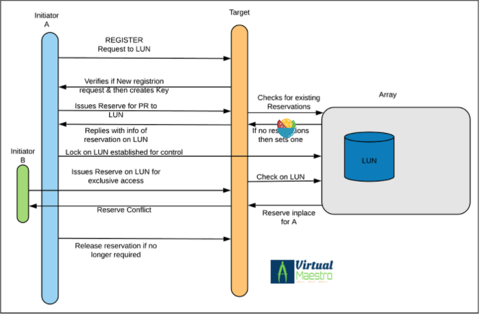

本文将对 SCSI 命令的基本结构进行简单的讲解，详细介绍 SCSI persistent reservations 机制的原理，并演示如何使用`sg_persist`命令查看 reservation 状态。
<!-- more -->
# SCSI 与 SCSI 命令

SCSI（Small Computer System Interface），通过 Client-Server 模式使主机和存储设备交换数据信息。主机为 Client 端（initiator）向作为 Server 端的存储设备（Target）发出例如：读写数据的请求。这类请求就是`SCSI command`。`SCSI command`体系结构最初是为并行 SCSI 总线设计的，但在进行小小的修改之后也可以与 FC、iSCSI、串行附加 SCSI 和其他传输层一起使用。

在 SCSI 协议中，initiator 向 target 发送**SCSI command information unit**。数据信息将在主机和存储设备中转发，最终设备会向主机发送一个**response information unit**。

## SCSI 命令结构

SCSI 命令封装在一个 CDB（command descriptor block）中，这个 CDB 中包含了一个 1 字节的操作码`opcode`，接着是 5 个或更多的与命令相关的参数。一旦收到 CDB 并完成处理，设备会返回一个 1 字节的状态码和其他的信息。

在发布的 SCSI 标准中，命令被分为：*强制的*、*可选的*和*供应商独占的*，只有强制的命令是所有设备都需要实现的。而且部分命令在不同类型的设备产生的操作略有不同，例如操作码 0x01 通过查找回物理扇区 0 来重新校准磁盘驱动器，但是在磁带驱动器中会倒带。

# SCSI 命令长度

起初，SCSI 操作码的最高有效 3 位指定了 CDB 的长度。但是，当可变长度 CDB 出现之后，这种对应关系就改变了，必须检查整个操作码才能确定 CDB 的长度。长度如下：

| Opcode (hex ) |                          Length                          |
| :-----------: | :------------------------------------------------------: |
|  00h to 1Fh   |                            6                             |
|  20h to 5Fh   |                            10                            |
|  60h to 7Dh   |                         reserved                         |
|      7Eh      |              variable (more than 16 bytes)               |
|      7Fh      | extended (variable length; may contain one or more CDBs) |
|  80h to 9Fh   |                            16                            |
|  A0h to BFh   |                            12                            |
|  C0h to FFh   |                     vendor specific                      |

当命令定义可能有多种 CDB size 的时候，CDB 的长度在命令名后的括号中给出，例如，`READ(6)`和`READ(10)`。

# SCSI-2 R & SCSI-3 PR

SCSI-2 R & SCSI-3 PR 是用于在集群中控制某个共享设备的访问权限的命令。initiator 对一个 LUN(logical unit number) 设置 reservation，以阻止其他 initiator 对该 LUN 进行修改。这和文件锁很像。SCSI reservations 通常由一个 initiator 设置，幸运的话该 LUN 会被同一个 initiator 使用 SCSI release 释放。

SCSI-2 R（SCSI-2 Reservations）是 SCSI 标准中制定的命令，有`RESERVE(6)`和`RESERVE(10)`在当前版本中已经被废弃，它的 optcode 为`16`和`56`。

SCSI-2 R 的实现机制是，initiator 通过 SCSI Reserve 命令设置一个 reservation，这个 reservation 可以被同一个主机通过 SCSI Relsese 命令释放或者被 SCSI 总线重置释放。**因此，由于错误恢复而执行的 SCSI 总线重置将导致 reservation 被释放**。

SCSI-3 PR（SCSI-3 Persistent Reservations）是 SCSI 标准中制定的命令。它包含了 2 个命令`PERSISTENT RESERVE IN`和`PERSISTENT RESERVE OUT`，opcode 分别为`5E`和`5F`。

Persistent Reservations 在 Reservations 的基础上增加了保持 Reservation 的能力，即使由于错误恢复而重置了 SCSI 总线，也可以保持 Reservation。

## SCSI-3 PR 是如何工作的

SCSI-3 PR 提供了控制共享设备访问权限的机制；

SCSI-3 PR 使用 registration 和 reservation 的概念。多个系统可以在一个共享的 SCSI-3 设备上注册自己的 key（PR_Key）。之后，已注册的系统可以使用以下的方式建立 reservation

- Write Exclusive (WE)
- Exclusive Access (EA)
- Write Exclusive – Registrants Only (WERO)
- Exclusive Access – Registrants Only (EARO)
- Write Exclusive – All Registrants (WEAR)
- Exclusive Access – All Registrants (EAAR)

对于 SCSI-3 PR，阻塞写访问或从设备删除注册是一个简单的过程。只有已注册的会员才能取消其他会员的注册。如果一个系统需要驱逐其他系统，它可以注册自己，抢占或清除其他已注册的发起者。



当一个 Reservation 冲突响应从 target 发送到 initiator 时，发生冲突的 initiator 需要重新发起 reserve 请求。initiator 主机的操作系统会控制发送 reserve 请求的间隔。发生冲突的主机会一直从 target 收到 reservation 冲突，直到发生如下情况：

- 当前拥有 reservation 的主机发出了 SCSI release 命令
- 一个 SCSI 总线重置了

`PERSISTENT RESERVE IN`和`PERSISTENT RESERVE OUT`

- `persistent reserve in`: Used by the initiator to read information on the target about existing reservations and registrations.
- `persistent reserve out`: Used by the initiator to register, set and alter its reservations, and break reservations for error recovery.

## 使用 sg_persist 命令查看 SCSI Reservation

```bash
$ yum install sg3_utils
```

查看 reservation key 注册情况

```bash
$ sg_persist /dev/sdb
>> No service action given; assume Persistent Reserve In command
>> with Read Keys service action
  LIO-ORG   server1.disk      4.0
  Peripheral device type: disk
  PR generation=0x1b, there are NO registered reservation keys
```

注册一个 reservation key

```bash
$ sg_persist --out --register --param-sark=abc123 /dev/sdb
  LIO-ORG   server1.disk      4.0
  Peripheral device type: disk
```

> 注意：在同一台物理机上只能注册一个 pr key，想要再注册一个 prkey，需要换一个物理机。

此时再查看 reservation key 注册情况

```bash
$sg_persist /dev/sdb
>> No service action given; assume Persistent Reserve In command
>> with Read Keys service action
  LIO-ORG   server1.disk      4.0
  Peripheral device type: disk
  PR generation=0x1c, 1 registered reservation key follows:
    0xabc123
```

Reserve 一个代表已注册的 LUN 的 key

```bash
$ sg_persist --out --reserve --param-rk=abc123 --prout-type=3 /dev/sdb
  LIO-ORG   server1.disk      4.0
  Peripheral device type: disk
```

**--prout-type**指定了 reservation 的类型：

- **1** : write exclusive
- **3** : exclusive access
- **5** : write exclusive – registrants only
- **6** : exclusive access – registrants only
- **7** : write exclusive – all registrants
- **8** : exclusive access – all registrants

查看 Reservations

```bash
$ sg_persist -r /dev/sdb
  LIO-ORG   server1.disk      4.0
  Peripheral device type: disk
  PR generation=0x1d, Reservation follows:
    Key=0xabc123
    scope: LU_SCOPE,  type: Exclusive Access
```

验证 reservation

在 node1（reserved）上，mount 磁盘：

```bash
$ mount /dev/sdb1 /mnt
$ mount | grep mnt
/dev/sdb1 on /mnt type ext3 (rw,relatime,errors=continue,user_xattr,acl,barrier=1,data=ordered)
$ umount /mnt
```

此时，无法在 node2 上访问该磁盘：

```bash
$ mount /dev/sdb1 /mnt
mount: mount /dev/sdb1 on /mnt failed: Invalid exchange
```

dmesg 上显示 reservation 冲突：

```bash
$ dmesg | tail
[6902380.608058] sd 11:0:0:1: [sdc] tag#16 FAILED Result: hostbyte=DID_OK driverbyte=DRIVER_OK
[6902380.608060] sd 11:0:0:1: [sdc] tag#16 CDB: Read(10) 28 00 00 1f ff 80 00 00 08 00
[6902380.608061] blk_update_request: critical nexus error, dev sdc, sector 2097024
[6902380.608064] Buffer I/O error on dev sdc1, logical block 261872, async page read
[6902380.609007] sd 11:0:0:1: reservation conflict
[6902380.609011] sd 11:0:0:1: [sdc] tag#14 FAILED Result: hostbyte=DID_OK driverbyte=DRIVER_OK
[6902380.609013] sd 11:0:0:1: [sdc] tag#14 CDB: Read(10) 28 00 00 00 08 00 00 00 01 00
[6902380.609015] blk_update_request: critical nexus error, dev sdc, sector 2048
[6902380.609523] sd 11:0:0:1: reservation conflict
[6902380.609526] blk_update_request: critical nexus error, dev sdc, sector 0
```

释放 reservation

```bash
$ sg_persist --out --release --param-rk=abc123 --prout-type=3 /dev/sdb
```

注销 reservation key

```bash
$ sg_persist --out --register --param-rk=abc123 /dev/sdb
```

# Reference

[SCSI Commands Reference Manual](https://www.seagate.com/files/staticfiles/support/docs/manual/Interface%20manuals/100293068j.pdf)

[What are SCSI Reservations and SCSI Persistent Reservations?](https://kb.netapp.com/Advice_and_Troubleshooting/Data_Storage_Software/ONTAP_OS/What_are_SCSI_Reservations_and_SCSI_Persistent_Reservations%3F)

